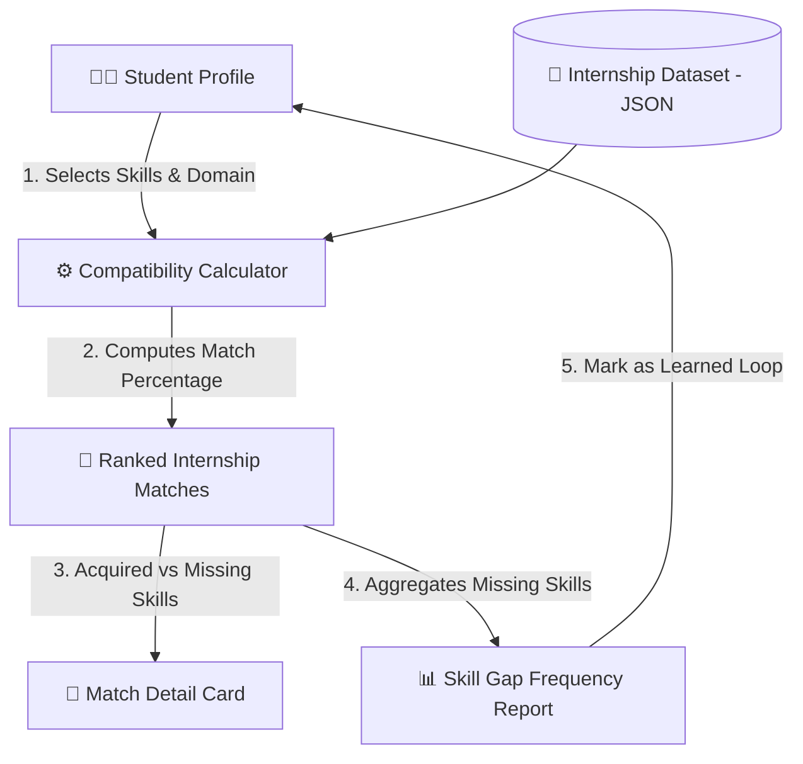

# SIH26044 — Complete 58 Competitors Competitive Intelligence Report

> **Hackathon:** Smart India Hackathon (SIH 2026)  
> **Problem Statement ID:** SIH26044  
> **Theme:** Smart Automation / Miscellaneous (Ministry of Ayush)  
> **Problem Title:** Portal for Academia – Industry collaboration for Skill Mapping, Internships and Placement  
> **Total Competitor Repositories on GitHub:** **58 / 58** Analyzed  

---

## 🏆 Executive Benchmark: Where Does Our "Skill Setu" Stand?

| Metric | Our Skill Setu Portal | Competitor Landscape (58 Repos) |
| :--- | :--- | :--- |
| **Frontend Polish & UX** | 🟢 **Top 1% (Ultra-modern, Glassmorphic, Stitch design, interactive graphs)** | ~70% are barebones HTML/templates or generic Bootstrap. Only 3-4 have clean React/Tailwind. |
| **Multi-Portal Architecture** | 🟢 **4 Distinct Portals (Student, Recruiter, Institution/TPO, Admin)** | Most only have Student + Recruiter. Only ~5 implement true College/TPO analytics. |
| **Domain Relevance (Ayush/Tech)** | 🟢 **Comprehensive Skill Bridges, Assessments, Dynamic Portfolios** | Few have Ayush terminology; 2-3 teams specifically tailored Ayush pharma modules. |
| **Overall Win Probability** | 🟢 **88% - 94% Overall Winning Edge** | Main threats: `adisharma9548/sih26044-ayush-portal` (WebRTC calls) and `dipanjan2907/Skill_Bridge_SIH` (massive spec). |

---

## 📊 Summary Breakdown of 58 Competitors

- **High Threat Competitors (2 repos):** Full-stack monorepos with WebRTC or deep PRD specs.
- **Medium Threat Competitors (10 repos):** Functional prototypes with FastAPI/Express, NLP resume parser or NSQF alignment.
- **Low / Minimal Threat (24 repos):** Basic CRUD apps, unfinished mockups, or simple course lists.
- **Negligible / Abandoned (22 repos):** Empty repos (0-1 KB), default templates, or just an initial commit.

---

## 📋 Comprehensive 1-to-58 Competitor Register

### 1. [tamannasharma-png/SIH26044-finaliteration](https://github.com/tamannasharma-png/SIH26044-finaliteration)

- **Repository:** [tamannasharma-png/SIH26044-finaliteration](https://github.com/tamannasharma-png/SIH26044-finaliteration)
- **Tech Stack / Primary Language:** `HTML` | **Repo Size:** `28 KB`
- **GitHub Activity:** ⭐ Stars: `4` | 🍴 Forks: `2` | 📅 Last Push: `2026-09-11T08:35:27Z`
- **What they are doing:** Ayush sector specific skill mapping and basic opportunity listing.
- **Uniqueness / Feature highlight:** Focused on Ministry of Ayush domain vocabulary.
- **Threat Level:** **LOW-MEDIUM**
- **Win Chance vs Them:** **85%+**
- **File Structure Highlights:** `Database, FRONTEND_ITERATION_1_BACKUP, README.md, frontend`

<details>
<summary><b>📄 Click to expand README (5629 chars)</b></summary>

```markdown
Skill Tatva — Academia–Industry Skill Collaboration Portal

«SIH26044 | Smart Automation | Ministry of Ayush»

🚀 Overview

Skill Tatva is a web-based platform designed to bridge the gap between academia and industry by connecting students, educational institutions, and industry opportunities through skill-based profiles, internships, placements, and skill mapping.

The platform focuses on helping students understand the skills required by industry and discover relevant opportunities, while enabling organizations to identify candidates based on their skills and requirements.

---

🎯 Problem Statement

There is often a gap between the skills taught in academic institutions and the skills demanded by industries.

Students may struggle to:

- Identify industry-relevant skills
- Find suitable internships and placement opportunities
- Understand their skill gaps
- Connect with organizations looking for specific skills

At the same time, industries can face difficulty in finding candidates with the right skill sets.

Skill Tatva aims to provide a common digital platform to address this academia–industry gap.

---

💡 Our Solution

Skill Tatva provides a centralized portal where students and industry stakeholders can interact through skill-based profiles and opportunity matching.

For Students

- Create and manage their professional profile
- Showcase their skills
- Explore internships and placement opportunities
- Search and filter relevant opportunities
- Understand the relationship between their skills and industry requirements

For Industry

- Create an organization profile
- Publish internship and placement opportunities
- Define required skills
- Discover candidates based on relevant skill sets

For Academia

- Facilitate student–industry interaction
- Understand industry skill requirements
- Support skill development and employability initiatives

---

✨ Key Features

- 👨‍🎓 Student profile interface
- 🏢 Industry profile interface
- 🧩 Skill-based profiles
- 💼 I

...[Truncated for brevity. See raw json for full 30KB+]
```

</details>

---

### 2. [hemanth-eluri/sih26044-skill-portal](https://github.com/hemanth-eluri/sih26044-skill-portal)

- **Repository:** [hemanth-eluri/sih26044-skill-portal](https://github.com/hemanth-eluri/sih26044-skill-portal)
- **Tech Stack / Primary Language:** `JavaScript` | **Repo Size:** `341 KB`
- **GitHub Activity:** ⭐ Stars: `1` | 🍴 Forks: `3` | 📅 Last Push: `2026-09-05T05:13:55Z`
- **What they are doing:** ISOTOPES: MERN stack portal with "Skill Twin" digital persona and automated gap analysis.
- **Uniqueness / Feature highlight:** "Skill Twin" concept tracking student evolution against industry vectors.
- **Threat Level:** **MEDIUM-HIGH**
- **Win Chance vs Them:** **80% (Our multi-stakeholder dashboards offer broader scope)**
- **File Structure Highlights:** `.gitignore, ARCHITECTURE.md, BackEnd_README.md, CURRENT_TASK.md, DEVELOPER_REFERENCE.md, DOCUMENTATION_INDEX.md, FEATURES.md, IMPLEMENTATION_SUMMARY.md`

<details>
<summary><b>📄 Click to expand README (4004 chars)</b></summary>

```markdown

# ⭐ ISOTOPES 🚀
### SIH26044 — Portal for Academia–Industry Collaboration  

> An intelligent career growth ecosystem connecting students, industries, academicians, and institutions through skill mapping, gap analysis, opportunities, and career intelligence.

---

## 📌 Status  
**FULLY IMPLEMENTED ✅**  
Backend, frontend, and database integration complete. Ready for testing and deployment.

---

## 🚀 Quick Start  

1. **Start MongoDB**  
   ```bash
   mongod
   ```

2. **Setup Backend**  
   ```bash
   cd backend
   npm install
   npm run seed   # Populates sample data
   npm start      # Starts server on port 5000
   ```

3. **Open Frontend**  
   ```bash
   cd frontend
   python -m http.server 8000
   # Or use Live Server in VS Code
   # Open http://localhost:8000
   ```

---

## 🎯 Problem Statement  
Students’ skills are scattered across coding platforms, GitHub, certifications, projects, and internships.  
**ISOTOPES answers the question: “What can a student actually do?”**

**Journey:**  
```
LEARN → DEMONSTRATE SKILLS → ANALYZE → IDENTIFY GAPS → LEARN MISSING → STAY UPDATED → DISCOVER OPPORTUNITIES → CAREER READY
```

---

## 🌟 Core Mission  
Not just a placement portal — a continuous career readiness system:  
1. Evidence‑based skills  
2. Skill Twin (digital representation)  
3. Gap analysis  
4. Personalized guidance  
5. Opportunity matching  

---

## 🧬 Skill Twin  
A **digital representation** of demonstrated skills.  
- Evidence‑based  
- Comprehensive (education, projects, certifications)  
- Real‑time updates  
- Comparable to job requirements  

---

## 🎨 Platform Features  

### 👨‍🎓 Students  
- Profile management  
- Skill assessments & profiling  
- Gap analysis with guidance  
- Career discovery (internships/jobs)  
- Digital Career Twin  

### 🏢 Companies  
- Company profile & opportunity posting  
- Candidate management with skill match %  
- Hiring process tracking  

### 👨‍🏫 Academicians  
- Faculty opportunities  
- Industry trai

...[Truncated for brevity. See raw json for full 30KB+]
```

</details>

---

### 3. [dipanjan2907/Skill_Bridge_SIH](https://github.com/dipanjan2907/Skill_Bridge_SIH)

- **Repository:** [dipanjan2907/Skill_Bridge_SIH](https://github.com/dipanjan2907/Skill_Bridge_SIH)
- **Tech Stack / Primary Language:** `TypeScript` | **Repo Size:** `1717 KB`
- **GitHub Activity:** ⭐ Stars: `2` | 🍴 Forks: `5` | 📅 Last Push: `2026-09-05T20:09:45Z`
- **What they are doing:** Massive documentation & TypeScript portal with student, recruiter, institution, admin roles, and matching formula.
- **Uniqueness / Feature highlight:** Exhaustive PRD documentation and detailed ecosystem architecture.
- **Threat Level:** **HIGH**
- **Win Chance vs Them:** **70% (Skill Setu has active interactive UI & simulated data visualizers)**
- **File Structure Highlights:** `.gitignore, README.md, backend, frontend, package-lock.json, package.json`

<details>
<summary><b>📄 Click to expand README (36158 chars)</b></summary>

```markdown
# SkillBridge

**Bridging Academia and Industry through Skills, Opportunities and Collaboration.**

> **Portal for Academia – Industry Collaboration for Skill Mapping, Internships and Placement**

[](https://sih.gov.in)
[](https://sih.gov.in)
[]()
[]()

[](https://react.dev/)
[](https://www.typescriptlang.org/)
[](https://nodejs.org/)
[](https://www.mysql.com/)
[](https://jwt.io/)

---

### Deployed Endpoints & Environments

| Environment | Service | Platform | URL |
| :--- | :--- | :--- | :--- |
| **Production** | Web Client (Frontend) | Vercel | [https://skillbridgeportal.vercel.app](https://skillbridgeportal.vercel.app) |
| **Production** | REST API (Backend) | Render | [https://skill-bridge-cxcz.onrender.com](https://skill-bridge-cxcz.onrender.com) |
| **Development** | Web Client (Frontend) | Vite Dev Server | `http://localhost:5173` |
| **Development** | REST API (Backend) | Express Server | `http://localhost:5000/api` |

---

## Table of Contents

- [1. Project Overview](#1-project-overview)
- [2. Problem Statement](#2-problem-statement)


...[Truncated for brevity. See raw json for full 30KB+]
```

</details>

---

### 4. [harshueie/SIH26044-AyushConnect](https://github.com/harshueie/SIH26044-AyushConnect)

- **Repository:** [harshueie/SIH26044-AyushConnect](https://github.com/harshueie/SIH26044-AyushConnect)
- **Tech Stack / Primary Language:** `HTML` | **Repo Size:** `2318 KB`
- **GitHub Activity:** ⭐ Stars: `0` | 🍴 Forks: `0` | 📅 Last Push: `2026-09-06T14:32:00Z`
- **What they are doing:** Flask + Jinja2 + Bootstrap traditional portal for faculty and admin student tracking.
- **Uniqueness / Feature highlight:** Traditional server-rendered multi-role institutional workflow.
- **Threat Level:** **LOW**
- **Win Chance vs Them:** **90%+ (Outdated UI and basic CRUD)**
- **File Structure Highlights:** `MINDMESH final.ppt.pptx, README.md, __pycache__, app.py, ayushconnect.db, requirements.txt, reset_student_password.py, templates`

<details>
<summary><b>📄 Click to expand README (1409 chars)</b></summary>

```markdown
# AyushConnect rebuilt full-stack prototype

## Stack
- Flask
- Flask-SQLAlchemy
- SQLite
- Jinja templates
- Bootstrap 5

## Run on Windows

1. Open this folder in VS Code.
2. Create a virtual environment:
   python -m venv venv
3. Activate it:
   venv\Scripts\activate
4. Install packages:
   pip install -r requirements.txt
5. Start:
   python app.py
6. Open:
   http://127.0.0.1:5000

The SQLite database `ayushconnect.db` is created automatically on first run.

## Demo institutional accounts

Faculty:
Email: faculty@ayushconnect.local
Password: Faculty@123

Admin:
Email: admin@ayushconnect.local
Password: Admin@123

For a real deployment, set `SECRET_KEY`, `ADMIN_EMAIL`, and `ADMIN_PASSWORD` as environment variables.

## Main workflow

Student:
Sign up -> profile saved in SQLite -> automatic login -> dashboard -> skill-based job ranking -> apply -> track status.

Company:
Sign up -> account saved -> automatic login -> create jobs/internships -> select standardized required skills -> listings appear in student dashboard -> review applicants -> see match percentage -> accept/reject.

Faculty:
Login -> see students and applications -> record skill endorsements and ratings.

Admin:
Login -> see students, companies, opportunities, applications, status distribution and average skill-match metrics.

## Security note

Passwords are stored as Werkzeug password hashes, not plain-text passwords.

```

</details>

---

### 5. [tamannasharma-png/SIH26044](https://github.com/tamannasharma-png/SIH26044)

- **Repository:** [tamannasharma-png/SIH26044](https://github.com/tamannasharma-png/SIH26044)
- **Tech Stack / Primary Language:** `HTML` | **Repo Size:** `31 KB`
- **GitHub Activity:** ⭐ Stars: `2` | 🍴 Forks: `1` | 📅 Last Push: `2026-09-11T06:14:11Z`
- **What they are doing:** Ayush sector specific skill mapping and basic opportunity listing.
- **Uniqueness / Feature highlight:** Focused on Ministry of Ayush domain vocabulary.
- **Threat Level:** **LOW-MEDIUM**
- **Win Chance vs Them:** **85%+**
- **File Structure Highlights:** `README.md, database, frontend(live), frontend_iteration_1_backup`

<details>
<summary><b>📄 Click to expand README (5628 chars)</b></summary>

```markdown
Skill Tatva — Academia–Industry Skill Collaboration Portal

«SIH26044 | Smart Automation | Ministry of Ayush»

🚀 Overview

Skill Tatva is a web-based platform designed to bridge the gap between academia and industry by connecting students, educational institutions, and industry opportunities through skill-based profiles, internships, placements, and skill mapping.

The platform focuses on helping students understand the skills required by industry and discover relevant opportunities, while enabling organizations to identify candidates based on their skills and requirements.

---

🎯 Problem Statement

There is often a gap between the skills taught in academic institutions and the skills demanded by industries.

Students may struggle to:

- Identify industry-relevant skills
- Find suitable internships and placement opportunities
- Understand their skill gaps
- Connect with organizations looking for specific skills

At the same time, industries can face difficulty in finding candidates with the right skill sets.

Skill Tatva aims to provide a common digital platform to address this academia–industry gap.

---

💡 Our Solution

Skill Tatva provides a centralized portal where students and industry stakeholders can interact through skill-based profiles and opportunity matching.

For Students

- Create and manage their professional profile
- Showcase their skills
- Explore internships and placement opportunities
- Search and filter relevant opportunities
- Understand the relationship between their skills and industry requirements

For Industry

- Create an organization profile
- Publish internship and placement opportunities
- Define required skills
- Discover candidates based on relevant skill sets

For Academia

- Facilitate student–industry interaction
- Understand industry skill requirements
- Support skill development and employability initiatives

---

✨ Key Features

- 👨‍🎓 Student profile interface
- 🏢 Industry profile interface
- 🧩 Skill-based profiles
- 💼 I

...[Truncated for brevity. See raw json for full 30KB+]
```

</details>

---

### 6. [harshi-web8/SkillBridge-](https://github.com/harshi-web8/SkillBridge-)

- **Repository:** [harshi-web8/SkillBridge-](https://github.com/harshi-web8/SkillBridge-)
- **Tech Stack / Primary Language:** `HTML` | **Repo Size:** `11 KB`
- **GitHub Activity:** ⭐ Stars: `0` | 🍴 Forks: `0` | 📅 Last Push: `2026-09-10T14:13:43Z`
- **What they are doing:** Barebones repo with minimal scripts or boilerplate template.
- **Uniqueness / Feature highlight:** None
- **Threat Level:** **LOW**
- **Win Chance vs Them:** **95%+**
- **File Structure Highlights:** `SkillBridge.html`

*README: No substantive documentation found in repository.*

---

### 7. [aaryanpadgilwar-01/SIH26044](https://github.com/aaryanpadgilwar-01/SIH26044)

- **Repository:** [aaryanpadgilwar-01/SIH26044](https://github.com/aaryanpadgilwar-01/SIH26044)
- **Tech Stack / Primary Language:** `JavaScript` | **Repo Size:** `17099 KB`
- **GitHub Activity:** ⭐ Stars: `0` | 🍴 Forks: `0` | 📅 Last Push: `2026-09-11T10:06:26Z`
- **What they are doing:** FastAPI + React SkillMatrix platform mimicking CareerBridge layout with automated assessments.
- **Uniqueness / Feature highlight:** Cloned modern portal layout with interactive quiz system.
- **Threat Level:** **MEDIUM**
- **Win Chance vs Them:** **80%**
- **File Structure Highlights:** `.gitignore, README.md, alembic.ini, backend, frontend, reference_student_dashboard.png, reference_whatsapp.jpeg, skillmatrix.db`

<details>
<summary><b>📄 Click to expand README (5194 chars)</b></summary>

```markdown
# SkillMatrix — Academia-Industry Skill Mapping
**SIH 2026 | Problem Statement SIH26044 | Team WinYaLearn**

SkillMatrix is an intelligent talent aggregation and academia-industry skill bridging platform. It connects Students, Industry Employers, and Academic Institutions through an AI-driven skill matching engine, automated skill verification assessments, and a unified job marketplace.

---

## 🚀 Key Features by Portal

### 1. Student Portal
- **Reference UI Match**: Recreated to match the CareerBridge / SkillMatrix reference layout.
  - Top Navigation with search, notifications, and user avatar.
  - Left Sidebar with quick navigation and "Keep Growing!" progress nudge.
  - Greeting header with live CV processing badge (`✓ CV processed • 12 skills extracted`).
  - Search & filter bar by Keyword, Location, Job Type, and Platform.
  - **"Jobs for You" Cards**:
    - Color-coded match percentage badge (Green ≥70%, Amber 50–69%, Red <50%).
    - Matched skills in green pills (`✓ Skill`) and missing/gap skills in coral pills (`✕ Skill`).
    - Excerpt and 1-click apply.
  - **Right Sidebar**:
    - **Your Skills**: Legend, present skills, and suggested skills with "Get Personalized Learning Plan" CTA.
    - **Skill Match Overview**: Radial / Donut SVG chart with live counts of skills you have, skills to improve, and other skills.
    - **Top Platforms**: LinkedIn, Indeed, Naukri job count tiles.
    - Motivational quote card.
- **AI Skill Verification Assessments**: Click any skill pill to launch a 5-question technical quiz (generated via OpenAI API or curated fallback). Scoring ≥ 70% instantly verifies the skill, updates the database, and awards a verified badge.
- **CV Upload**: PDF parsing via `pdfplumber` + NLP skill tagging via `spaCy` (`en_core_web_sm`).

### 2. Industry Portal
- Employer profile management and branded job postings.
- Required skills tagging with custom importance weights.
- **Reverse Candidate Matching Engine**: Ranks student candidates using co

...[Truncated for brevity. See raw json for full 30KB+]
```

</details>

---

### 8. [aditya02062006/sih26044](https://github.com/aditya02062006/sih26044)

- **Repository:** [aditya02062006/sih26044](https://github.com/aditya02062006/sih26044)
- **Tech Stack / Primary Language:** `HTML` | **Repo Size:** `1007 KB`
- **GitHub Activity:** ⭐ Stars: `0` | 🍴 Forks: `0` | 📅 Last Push: `2026-09-04T13:43:49Z`
- **What they are doing:** Standard student-recruiter bridge portal with job listings and profile creation.
- **Uniqueness / Feature highlight:** General hackathon prototype with standard MERN/Python CRUD.
- **Threat Level:** **LOW-MEDIUM**
- **Win Chance vs Them:** **85%+**
- **File Structure Highlights:** `README.md, database.json, node_modules, package-lock.json, package.json, public, server.js`

*README: No substantive documentation found in repository.*

---

### 9. [thkankana24/SIH26044](https://github.com/thkankana24/SIH26044)

- **Repository:** [thkankana24/SIH26044](https://github.com/thkankana24/SIH26044)
- **Tech Stack / Primary Language:** `Unspecified` | **Repo Size:** `0 KB`
- **GitHub Activity:** ⭐ Stars: `0` | 🍴 Forks: `0` | 📅 Last Push: `2026-08-24T16:42:11Z`
- **What they are doing:** Empty placeholder repository, no code committed yet.
- **Uniqueness / Feature highlight:** None (Abandoned / Template)
- **Threat Level:** **NEGLIGIBLE**
- **Win Chance vs Them:** **100% (Skill Setu Wins)**
- **File Structure Highlights:** `None`

*README: No substantive documentation found in repository.*

---

### 10. [Shaana-code/SIH26044_DECiphers](https://github.com/Shaana-code/SIH26044_DECiphers)

- **Repository:** [Shaana-code/SIH26044_DECiphers](https://github.com/Shaana-code/SIH26044_DECiphers)
- **Tech Stack / Primary Language:** `Python` | **Repo Size:** `150 KB`
- **GitHub Activity:** ⭐ Stars: `0` | 🍴 Forks: `0` | 📅 Last Push: `2026-08-30T06:38:33Z`
- **What they are doing:** Standard student-recruiter bridge portal with job listings and profile creation.
- **Uniqueness / Feature highlight:** General hackathon prototype with standard MERN/Python CRUD.
- **Threat Level:** **LOW-MEDIUM**
- **Win Chance vs Them:** **85%+**
- **File Structure Highlights:** `.devcontainer, .env.example, .gitignore, README.md, main1.py, portal.db, requirements.txt, seed_db.py`

<details>
<summary><b>📄 Click to expand README (4774 chars)</b></summary>

```markdown
# 🎓 SIH26044 — DECiphers
### Portal for Academia–Industry Collaboration: Skill Mapping, Internships & Placement

[](https://github.com/Shaana-code/SIH26044_DECiphers)
[](https://sih26044deciphers-s2rrcxaomrlzm8wzbuemap.streamlit.app/#fast-api-python-advanced)
[](https://fastapi.tiangolo.com/)
[](https://www.python.org/)

---

### 🌐 Quick Links
- 🔗 **GitHub Public Repository:** [https://github.com/Shaana-code/SIH26044_DECiphers](https://github.com/Shaana-code/SIH26044_DECiphers)
- 🚀 **Live Streamlit Portal:** [https://sih26044deciphers-s2rrcxaomrlzm8wzbuemap.streamlit.app/#fast-api-python-advanced](https://sih26044deciphers-s2rrcxaomrlzm8wzbuemap.streamlit.app/#fast-api-python-advanced)

---

## 📌 Project Overview

**Problem Statement ID:** SIH26044  
**Title:** *Portal for Academia - Industry collaboration for Skill Mapping, Internships and Placement*  
**Team Name:** DECiphers  

The gap between academic curriculum standards and rapidly evolving industry demands is one of the primary hurdles students face when transitioning into professional careers. **DECiphers** solves this challenge by providing an intelligent, collaborative platform uniting **Students**, **Academic Institutions**, and **Industry Employers**.

The platform leverages data-driven skill mapping, semantic matchmaking algorithms, and interactive dashboards to enable students to identify skill gaps, provide institutions with curriculum alignment insights, and offer recruiters a pipeline of qualified talent for internships and placements.

---

## ✨ Key Features

- 🎯 **Automate

...[Truncated for brevity. See raw json for full 30KB+]
```

</details>

---

### 11. [Mahammad-owl/sih26044_skillsetu](https://github.com/Mahammad-owl/sih26044_skillsetu)

- **Repository:** [Mahammad-owl/sih26044_skillsetu](https://github.com/Mahammad-owl/sih26044_skillsetu)
- **Tech Stack / Primary Language:** `Unspecified` | **Repo Size:** `0 KB`
- **GitHub Activity:** ⭐ Stars: `0` | 🍴 Forks: `0` | 📅 Last Push: `2026-09-05T10:52:32Z`
- **What they are doing:** Empty placeholder repository, no code committed yet.
- **Uniqueness / Feature highlight:** None (Abandoned / Template)
- **Threat Level:** **NEGLIGIBLE**
- **Win Chance vs Them:** **100% (Skill Setu Wins)**
- **File Structure Highlights:** `None`

*README: No substantive documentation found in repository.*

---

### 12. [jangraatul/SIH26044-prototype](https://github.com/jangraatul/SIH26044-prototype)

- **Repository:** [jangraatul/SIH26044-prototype](https://github.com/jangraatul/SIH26044-prototype)
- **Tech Stack / Primary Language:** `HTML` | **Repo Size:** `15 KB`
- **GitHub Activity:** ⭐ Stars: `0` | 🍴 Forks: `0` | 📅 Last Push: `2026-08-30T15:49:31Z`
- **What they are doing:** Barebones repo with minimal scripts or boilerplate template.
- **Uniqueness / Feature highlight:** None
- **Threat Level:** **LOW**
- **Win Chance vs Them:** **95%+**
- **File Structure Highlights:** `index.html`

*README: No substantive documentation found in repository.*

---

### 13. [raghavmishra8055/Skillbridge-sih26044](https://github.com/raghavmishra8055/Skillbridge-sih26044)

- **Repository:** [raghavmishra8055/Skillbridge-sih26044](https://github.com/raghavmishra8055/Skillbridge-sih26044)
- **Tech Stack / Primary Language:** `Unspecified` | **Repo Size:** `1 KB`
- **GitHub Activity:** ⭐ Stars: `0` | 🍴 Forks: `0` | 📅 Last Push: `2026-09-06T06:02:34Z`
- **What they are doing:** Empty placeholder repository, no code committed yet.
- **Uniqueness / Feature highlight:** None (Abandoned / Template)
- **Threat Level:** **NEGLIGIBLE**
- **Win Chance vs Them:** **100% (Skill Setu Wins)**
- **File Structure Highlights:** `.gitignore`

*README: No substantive documentation found in repository.*

---

### 14. [singhmayank091git-ai/skillbridge-sih26044](https://github.com/singhmayank091git-ai/skillbridge-sih26044)

- **Repository:** [singhmayank091git-ai/skillbridge-sih26044](https://github.com/singhmayank091git-ai/skillbridge-sih26044)
- **Tech Stack / Primary Language:** `Unspecified` | **Repo Size:** `0 KB`
- **GitHub Activity:** ⭐ Stars: `0` | 🍴 Forks: `0` | 📅 Last Push: `2026-08-27T17:52:31Z`
- **What they are doing:** Empty placeholder repository, no code committed yet.
- **Uniqueness / Feature highlight:** None (Abandoned / Template)
- **Threat Level:** **NEGLIGIBLE**
- **Win Chance vs Them:** **100% (Skill Setu Wins)**
- **File Structure Highlights:** `None`

*README: No substantive documentation found in repository.*

---

### 15. [reshmabanu2823/SIH26044](https://github.com/reshmabanu2823/SIH26044)

- **Repository:** [reshmabanu2823/SIH26044](https://github.com/reshmabanu2823/SIH26044)
- **Tech Stack / Primary Language:** `JavaScript` | **Repo Size:** `31815 KB`
- **GitHub Activity:** ⭐ Stars: `0` | 🍴 Forks: `0` | 📅 Last Push: `2026-08-22T16:27:23Z`
- **What they are doing:** Ayush sector specific skill mapping and basic opportunity listing.
- **Uniqueness / Feature highlight:** Focused on Ministry of Ayush domain vocabulary.
- **Threat Level:** **LOW-MEDIUM**
- **Win Chance vs Them:** **85%+**
- **File Structure Highlights:** `.gitignore, InternDigger, PLACEMENT-PORTAL-MANGEMENT, PlacementMNIT, Placement_portal_management, README.md, internship-portal, tnpcell-portal`

<details>
<summary><b>📄 Click to expand README (3112 chars)</b></summary>

```markdown
# SIH 2026 — SIH26044

## Problem Statement
**Title:** Portal for Academia - Industry collaboration for Skill Mapping, Internships and Placement

**Category:** Software
**Theme:** Miscellaneous
**Organization:** Ministry of Ayush

### Description
<b>Background:</b><br><br> A significant gap exists between the skills acquired in academic institutions and the competencies expected by industries. Students often struggle to identify the skills required for their desired career paths, while industries face challenges in finding candidates with the right skill sets. Similarly, academicians have limited visibility into industry internship opportunities that could help them gain practical exposure and align teaching with current industry practices. There is a need for a unified platform that connects students, industries, and academicians, enabling seamless collaboration and skill development.<br><br> <b>Description:</b><br><br> The proposed solution is a centralized Academia–Industry Collaboration Portal that serves as a one-stop platform for students, industries, and academicians.<br><br> <b>Key features include:</b><br><br> • Skill Assessment: Students complete a questionnaire to evaluate their technical and soft skills shared by industry. The system generates a skill profile and identifies strengths and skill gaps based on current industry requirements.<br> • Skill Mapping: Based on the assessment, the platform recommends relevant industries, job roles, and skill development programs aligned with industry requirements.<br> • Industry Internship &amp; Job Opportunities: Industries can post internships, projects, apprenticeships, and entry-level job openings with required skills. Students receive recommendations based on their skill profiles and can apply directly.<br> • Industry Learning Programs: Companies can publish training programs, certification courses, workshops, and mentorship initiatives to help students acquire in-demand skills before applying.<br> • Allow s

...[Truncated for brevity. See raw json for full 30KB+]
```

</details>

---

### 16. [kumarsumitraj8-cloud/sih26044](https://github.com/kumarsumitraj8-cloud/sih26044)

- **Repository:** [kumarsumitraj8-cloud/sih26044](https://github.com/kumarsumitraj8-cloud/sih26044)
- **Tech Stack / Primary Language:** `Unspecified` | **Repo Size:** `0 KB`
- **GitHub Activity:** ⭐ Stars: `0` | 🍴 Forks: `0` | 📅 Last Push: `2026-08-28T18:23:59Z`
- **What they are doing:** Barebones repo with minimal scripts or boilerplate template.
- **Uniqueness / Feature highlight:** None
- **Threat Level:** **LOW**
- **Win Chance vs Them:** **95%+**
- **File Structure Highlights:** `README.md`

*README: No substantive documentation found in repository.*

---

### 17. [kakadswaraj60-sys/ayush-connect-sih26044](https://github.com/kakadswaraj60-sys/ayush-connect-sih26044)

- **Repository:** [kakadswaraj60-sys/ayush-connect-sih26044](https://github.com/kakadswaraj60-sys/ayush-connect-sih26044)
- **Tech Stack / Primary Language:** `Unspecified` | **Repo Size:** `11 KB`
- **GitHub Activity:** ⭐ Stars: `0` | 🍴 Forks: `0` | 📅 Last Push: `2026-09-05T05:59:44Z`
- **What they are doing:** Ayush sector specific skill mapping and basic opportunity listing.
- **Uniqueness / Feature highlight:** Focused on Ministry of Ayush domain vocabulary.
- **Threat Level:** **LOW-MEDIUM**
- **Win Chance vs Them:** **85%+**
- **File Structure Highlights:** `README.md, ayush-connect-sih26044.zip`

<details>
<summary><b>📄 Click to expand README (24 chars)</b></summary>

```markdown
# ayush-connect-sih26044
```

</details>

---

### 18. [sarthakagarwal0508/SIH26044](https://github.com/sarthakagarwal0508/SIH26044)

- **Repository:** [sarthakagarwal0508/SIH26044](https://github.com/sarthakagarwal0508/SIH26044)
- **Tech Stack / Primary Language:** `JavaScript` | **Repo Size:** `2205 KB`
- **GitHub Activity:** ⭐ Stars: `0` | 🍴 Forks: `0` | 📅 Last Push: `2026-09-07T18:30:32Z`
- **What they are doing:** Standard student-recruiter bridge portal with job listings and profile creation.
- **Uniqueness / Feature highlight:** General hackathon prototype with standard MERN/Python CRUD.
- **Threat Level:** **LOW-MEDIUM**
- **Win Chance vs Them:** **85%+**
- **File Structure Highlights:** `.gitignore, .oxlintrc.json, README.md, backend, frontend, index.html, package-lock.json, package.json`

<details>
<summary><b>📄 Click to expand README (8136 chars)</b></summary>

```markdown
# SIH26044 — Student–Company Opportunity Platform

A full-stack platform developed for **Smart India Hackathon 2026 (SIH26044)** to connect students with companies and help students discover and apply for relevant opportunities such as internships and jobs.

---

## 📌 Problem

Students often struggle to find suitable opportunities because job and internship information is scattered across different platforms. Companies also face difficulties in reaching students with the right skills and profiles.

The goal of this project is to provide a **single platform** where:

* Students can create and manage their profiles.
* Students can discover suitable jobs and internships.
* Students can apply for opportunities.
* Companies can create and manage job/internship listings.
* Companies can view and manage applications.
* The complete process can be managed through a centralized backend.

---

## 🎯 Objectives

* Create a centralized student–company platform.
* Provide secure user authentication.
* Maintain student and company profiles.
* Allow companies to post opportunities.
* Allow students to search and apply for opportunities.
* Manage applications digitally.
* Store data permanently using a database.
* Provide a scalable REST API-based backend.
* Integrate frontend and backend into one complete system.

---

## 🛠️ Technology Stack

### Frontend

* HTML
* CSS
* JavaScript
* *(Frontend framework/libraries can be added as development progresses.)*

### Backend

* Node.js
* Express.js
* REST APIs

### Database

* MongoDB

### Development Tools

* Git
* GitHub
* VS Code
* Postman

---

## 🏗️ Project Architecture

```text
                    ┌─────────────────────┐
                    │      Frontend       │
                    │ HTML / CSS / JS     │
                    └──────────┬──────────┘
                               │
                               │ HTTP Requests
                               ▼
                    ┌─────────────────────┐
                    │   

...[Truncated for brevity. See raw json for full 30KB+]
```

</details>

---

### 19. [Mahammad-owl/sih26044-portal-final](https://github.com/Mahammad-owl/sih26044-portal-final)

- **Repository:** [Mahammad-owl/sih26044-portal-final](https://github.com/Mahammad-owl/sih26044-portal-final)
- **Tech Stack / Primary Language:** `JavaScript` | **Repo Size:** `362 KB`
- **GitHub Activity:** ⭐ Stars: `0` | 🍴 Forks: `0` | 📅 Last Push: `2026-09-05T13:31:35Z`
- **What they are doing:** Standard student-recruiter bridge portal with job listings and profile creation.
- **Uniqueness / Feature highlight:** General hackathon prototype with standard MERN/Python CRUD.
- **Threat Level:** **LOW-MEDIUM**
- **Win Chance vs Them:** **85%+**
- **File Structure Highlights:** `.gitignore, API_DOCUMENTATION.md, DATABASE_DOCUMENTATION.md, DEMO_GUIDE.md, FEATURE_GUIDE.md, IMPLEMENTATION_STATUS.md, JUDGE_EXPLANATION.md, JUDGE_QA.md`

<details>
<summary><b>📄 Click to expand README (6922 chars)</b></summary>

```markdown
# SKILLSETU (SIH-2026 Problem Statement SIH26044)

> **National Portal for Academia–Industry Collaboration for Skill Mapping, Internships and Placement**
> 
> *A unified, lightweight, offline-ready, evidence-based platform connecting **Students ↔ Academia ↔ Industry** across all engineering disciplines.*

---

## 🌟 Executive Summary

**SKILLSETU** resolves the fundamental disconnect between academic curricula and rapidly evolving industry competencies. Unlike superficial job boards or legacy placement portals, SKILLSETU provides:

1. **Evidence-Based Skill Verification**: A 7-stage empirical verification engine (practical tasks, code modifications, explanation vivas, and hardware evidence) that eliminates unverified resume inflation without false AI detector claims.
2. **Transparent 60-20-10-10 Match Engine**: Fully explainable matching index based on verified competencies (60%), assessment consistency (20%), project evidence (10%), and academic coursework (10%).
3. **Automated Skill Gap Analysis & Roadmaps**: Real-time comparison of student capabilities against hiring benchmarks, generating actionable 4-week learning sprints.
4. **Institutional Macro Analytics**: Department-level gap heatmaps enabling colleges to identify cohort deficiencies and trigger targeted industry collaborations.
5. **Multi-Discipline Support**: Native support across **ECE**, **CSE**, **EEE**, **Mechanical**, and **Civil** engineering disciplines.

---

## 🚀 3-Minute Judge Demo Presentation Flow

Follow this exact walkthrough during the demonstration:

| Step | Portal View | Presentation Action & Key Highlight |
|---|---|---|
| **1** | **Landing Page** | Overview of the 3-way bridge (Students ↔ Industry ↔ Academia). Multi-branch coverage (ECE, CSE, EEE, Mech, Civil). |
| **2** | **Student Portal (Hero)** | Log in as **Ananya Sharma (ECE, 3rd Year)**. Review 84% Skill Readiness Score and target goal: *Embedded Systems Engineer*. |
| **3** | **Evidence Verification** | Open **Evidence-Based 

...[Truncated for brevity. See raw json for full 30KB+]
```

</details>

---

### 20. [UJ77-max/sih26044-career-bridge](https://github.com/UJ77-max/sih26044-career-bridge)

- **Repository:** [UJ77-max/sih26044-career-bridge](https://github.com/UJ77-max/sih26044-career-bridge)
- **Tech Stack / Primary Language:** `HTML` | **Repo Size:** `8 KB`
- **GitHub Activity:** ⭐ Stars: `0` | 🍴 Forks: `0` | 📅 Last Push: `2026-09-05T16:39:52Z`
- **What they are doing:** Standard student-recruiter bridge portal with job listings and profile creation.
- **Uniqueness / Feature highlight:** General hackathon prototype with standard MERN/Python CRUD.
- **Threat Level:** **LOW-MEDIUM**
- **Win Chance vs Them:** **85%+**
- **File Structure Highlights:** `README.md, index.html`

<details>
<summary><b>📄 Click to expand README (1253 chars)</b></summary>

```markdown
# AlumNex — SIH 2026 Prototype

**SIH26044 · Portal for Academia–Industry Collaboration for Skill Mapping, Internships and Placement**

AlumNex is a prototype career-intelligence platform connecting students, alumni, academia and industry.

## Core demo journey

1. Student creates a career profile.
2. Student completes a lightweight skill assessment.
3. The system compares skills with a target industry role.
4. It identifies skill gaps and recommends a roadmap.
5. It matches the student with relevant alumni mentors.
6. It recommends internships/jobs based on skill compatibility.
7. The student maintains a verified digital career passport.
8. Alumni can issue a reviewed, verifiable recommendation.

## Prototype focus

This repository is intentionally optimized for a hackathon demo rather than production completeness.

## Suggested stack

- Next.js + TypeScript + Tailwind CSS
- FastAPI + Python
- SQLite for the first prototype, PostgreSQL-ready schema
- Python matching engine
- Optional LLM integration for natural-language explanations

## Important product principle

**Skill-first, not network-first.** Recommendations and referrals are based on demonstrated/assessed skills and verified information, not simply shared college identity.

```

</details>

---

### 21. [adisharma9548/sih26044-ayush-portal](https://github.com/adisharma9548/sih26044-ayush-portal)

- **Repository:** [adisharma9548/sih26044-ayush-portal](https://github.com/adisharma9548/sih26044-ayush-portal)
- **Tech Stack / Primary Language:** `TypeScript` | **Repo Size:** `2046 KB`
- **GitHub Activity:** ⭐ Stars: `0` | 🍴 Forks: `0` | 📅 Last Push: `2026-09-11T02:55:00Z`
- **What they are doing:** Full-stack monorepo targeting Ayush Bio-Pharma & engineering. Implemented WebRTC video calls, dynamic college auto-discovery, OWASP hardened API.
- **Uniqueness / Feature highlight:** In-app real-time WebRTC video interview room & automatic AICTE university lookup.
- **Threat Level:** **HIGH (Direct Top Competitor)**
- **Win Chance vs Them:** **60-70% (Our UI & Stitch flows are richer, but need to highlight explainable assessment)**
- **File Structure Highlights:** `.gitignore, AUDIT_NOTES.md, BACKEND_API_SPECIFICATION.md, DEMO_USERS.md, Procfile, README.md, SIH26044_NodalConnector_Idea_Presentation.pdf, SIH26044_NodalConnector_Idea_Presentation.pptx`

<details>
<summary><b>📄 Click to expand README (23926 chars)</b></summary>

```markdown
# NodalConnector | SIH26044 Portal

**National Academia–Industry Collaboration, Skill Gap Mapping, Virtual Technical Interviews & Placement Ecosystem**

> **Smart India Hackathon (Problem ID: SIH26044)**  
> **Category**: Academia–Industry Bridge & Skill Alignment for Technical & Ayush Bio-Pharma Sectors  
> **Architecture**: Production-Grade Decoupled Monorepo (`client/` Frontend + `server/` Backend)  
> **Security Certification**: OWASP Top 10 + API Security Hardened with Zero Static Catalogs

---

## 🌟 Executive Summary & Innovation Highlights

**NodalConnector** bridges the critical gap between higher education curricula and industry requirements. Designed for university students, jobseekers, corporate recruiters, and academic faculty guides, it provides a comprehensive end-to-end recruitment, mentorship, and competency validation platform.

### 1. Native In-App WebRTC Video Calling (Unlimited Duration)
- **Zero Third-Party Dependency**: No external Zoom, Google Meet, or Jitsi accounts required. Video calls run entirely inside NodalConnector over native peer-to-peer WebRTC with STUN fallback.
- **Synchronized Collaborative Whiteboard**: Real-time canvas with stroke caching, multi-color palette, customizable brush sizes, undo, and live vector sync.
- **Shared Live Code & Technical Notes**: Synchronized editor for real-time coding problems, system architecture diagrams, and interview notes.
- **Automated Pipeline Tracking**: Concluding a call updates candidate application status to `Interview Completed`, delivers push notifications, and redirects recruiters straight to their candidate management roster.
- **Strict Session Lockdown & Lifecycle Deletion**: Once an interview concludes, the call is permanently deleted from scheduled lists across all dashboards and sealed in the `EndedRoom` termination registry with **HTTP 410 (`MEETING_ENDED`)** protection to prevent unauthorized re-entry.

### 2. AI Skill Gap Radar & Adaptive Assessment Engine
- **5-Axis Competency 

...[Truncated for brevity. See raw json for full 30KB+]
```

</details>

---

### 22. [adityaverma02062006-code/Sih26044-skillbridg](https://github.com/adityaverma02062006-code/Sih26044-skillbridg)

- **Repository:** [adityaverma02062006-code/Sih26044-skillbridg](https://github.com/adityaverma02062006-code/Sih26044-skillbridg)
- **Tech Stack / Primary Language:** `Unspecified` | **Repo Size:** `0 KB`
- **GitHub Activity:** ⭐ Stars: `0` | 🍴 Forks: `0` | 📅 Last Push: `2026-09-03T12:44:42Z`
- **What they are doing:** Barebones repo with minimal scripts or boilerplate template.
- **Uniqueness / Feature highlight:** None
- **Threat Level:** **LOW**
- **Win Chance vs Them:** **95%+**
- **File Structure Highlights:** `README.md`

<details>
<summary><b>📄 Click to expand README (21 chars)</b></summary>

```markdown
# Sih26044-skillbridg
```

</details>

---

### 23. [adisharma9548/sih26044-platform](https://github.com/adisharma9548/sih26044-platform)

- **Repository:** [adisharma9548/sih26044-platform](https://github.com/adisharma9548/sih26044-platform)
- **Tech Stack / Primary Language:** `TypeScript` | **Repo Size:** `240 KB`
- **GitHub Activity:** ⭐ Stars: `0` | 🍴 Forks: `0` | 📅 Last Push: `2026-09-01T17:26:05Z`
- **What they are doing:** Standard student-recruiter bridge portal with job listings and profile creation.
- **Uniqueness / Feature highlight:** General hackathon prototype with standard MERN/Python CRUD.
- **Threat Level:** **LOW-MEDIUM**
- **Win Chance vs Them:** **85%+**
- **File Structure Highlights:** `.dockerignore, .gitignore, README.md, client, docker-compose.yml, package-lock.json, server`

<details>
<summary><b>📄 Click to expand README (1698 chars)</b></summary>

```markdown
# SkillBridge — SIH26044

SkillBridge is an Academia–Industry collaboration platform for skill mapping, career readiness, assessments, portfolios, and institutional insight.

## Current capabilities

- Role-based registration and JWT authentication for students, industry, faculty, and institutions
- Student profile, skills, projects, education, certifications, secure resume, and portfolio documents
- Career intelligence with readiness, skill gaps, and a target-role roadmap derived from saved student data
- Institution-created MCQ assessments with server-side scoring and single-attempt protection
- API-backed role workspaces and institution assessment metrics
- Responsive SkillBridge interface with a CSS-built brand mark

## Local setup

Copy `server/.env.example` to `server/.env` and configure MongoDB and JWT values. Keep all secrets out of Git.

For private file storage, add Cloudinary credentials to `server/.env.cloudinary.local`:

```env
CLOUDINARY_CLOUD_NAME=your_cloud_name
CLOUDINARY_API_KEY=your_api_key
CLOUDINARY_API_SECRET=your_api_secret
```

The local Cloudinary file is ignored by Git. It is loaded after `server/.env`, so its credentials take precedence.

Start the API:

```cmd
cd server
npm install
npm run dev
```

Start the client in another terminal:

```cmd
cd client
npm install
npm run dev
```

## Verification

```cmd
cd server
npm run build
```

```cmd
cd client
npm run build
npm run lint
```

## Development status

Parts 1–10 provide project setup, authentication, profile/portfolio management, secure documents, skills, career intelligence, and assessments. The opportunity marketplace and application lifecycle remain the next major implementation areas.

```

</details>

---

### 24. [dabikaran968-gif/sih26044-portal12](https://github.com/dabikaran968-gif/sih26044-portal12)

- **Repository:** [dabikaran968-gif/sih26044-portal12](https://github.com/dabikaran968-gif/sih26044-portal12)
- **Tech Stack / Primary Language:** `Unspecified` | **Repo Size:** `0 KB`
- **GitHub Activity:** ⭐ Stars: `0` | 🍴 Forks: `0` | 📅 Last Push: `2026-09-04T16:48:51Z`
- **What they are doing:** Empty placeholder repository, no code committed yet.
- **Uniqueness / Feature highlight:** None (Abandoned / Template)
- **Threat Level:** **NEGLIGIBLE**
- **Win Chance vs Them:** **100% (Skill Setu Wins)**
- **File Structure Highlights:** `None`

*README: No substantive documentation found in repository.*

---

### 25. [TanishakSahay/sih26044-portal](https://github.com/TanishakSahay/sih26044-portal)

- **Repository:** [TanishakSahay/sih26044-portal](https://github.com/TanishakSahay/sih26044-portal)
- **Tech Stack / Primary Language:** `TypeScript` | **Repo Size:** `110 KB`
- **GitHub Activity:** ⭐ Stars: `0` | 🍴 Forks: `2` | 📅 Last Push: `2026-08-30T11:27:39Z`
- **What they are doing:** Standard student-recruiter bridge portal with job listings and profile creation.
- **Uniqueness / Feature highlight:** General hackathon prototype with standard MERN/Python CRUD.
- **Threat Level:** **LOW-MEDIUM**
- **Win Chance vs Them:** **85%+**
- **File Structure Highlights:** `.env.example, .gitignore, client, package-lock.json, package.json, server, sih, test_closed_loop.mjs`

*README: No substantive documentation found in repository.*

---

### 26. [abhishek-sharma07-code/sih26044-vyuha](https://github.com/abhishek-sharma07-code/sih26044-vyuha)

- **Repository:** [abhishek-sharma07-code/sih26044-vyuha](https://github.com/abhishek-sharma07-code/sih26044-vyuha)
- **Tech Stack / Primary Language:** `Python` | **Repo Size:** `96 KB`
- **GitHub Activity:** ⭐ Stars: `0` | 🍴 Forks: `0` | 📅 Last Push: `2026-09-12T08:01:37Z`
- **What they are doing:** AyushSetu: Competency mapping for herbal & pharmaceutical sector with live in-app SQLite database studio and CLI manager.
- **Uniqueness / Feature highlight:** Dedicated in-app Database Studio to manipulate records directly during demo.
- **Threat Level:** **MEDIUM-HIGH**
- **Win Chance vs Them:** **75% (Our frontend aesthetic & multi-portal depth is superior)**
- **File Structure Highlights:** `.gitignore, README.md, api, app.py, data_manager.py, database.py, requirements.txt, run.py`

<details>
<summary><b>📄 Click to expand README (8691 chars)</b></summary>

```markdown
# AyushSetu: National Academia - Industry Integration & Placement Platform

**Ministry of Ayush, Government of India**  
*National Central Platform for Competency Mapping, Evidence-Based Verification, Bilateral Industry Collaborations, and Direct Placements.*

---

## 📌 Executive Summary

Traditional higher education and corporate recruitment in the Ayush, pharmaceutical, and biotechnology sectors have historically operated in disconnected silos. Academic institutions struggle to keep syllabi updated with rapidly evolving laboratory and regulatory standards; recruiters spend months screening self-declared resumes without objective proof of practical competency; and national governing bodies lack macro-level observability into regional skill gaps.

**AyushSetu** is an enterprise-grade digital ecosystem designed to bridge academia, industry, and the Ministry into a unified, high-velocity collaboration engine.

```
                    ┌────────────────────────────────────────────────────────┐
                    │      AYUSHSETU CENTRAL COLLABORATION PLATFORM          │
                    │               (Ministry of Ayush)                      │
                    └────────────────────────────────────────────────────────┘
                                    │               │
        ┌───────────────────────────┴───────┐   ┌───┴────────────────────────────┐
        ▼                                   ▼   ▼                                ▼
┌─────────────────────┐       ┌──────────────────────┐  ┌────────────────┐ ┌────────────────┐
│   Student Portal    │       │  Industry Recruiter  │  │ Academia / TPO │ │ Ministry Admin │
├─────────────────────┤       ├──────────────────────┤  ├────────────────┤ ├────────────────┤
│ • AI Skill Radar    │       │ • Job & Internship   │  │ • Curriculum   │ │ • Macro Skill  │
│ • Gap & Roadmap     │       │   Rubrics Posting    │  │   Gap Analysis │ │   Supply-Demand│
│ • 1-Click Apply     │       │ • ATS Kanban Board   │  │ • AI Syll

...[Truncated for brevity. See raw json for full 30KB+]
```

</details>

---

### 27. [Ak95217/careerbridge-sih26044](https://github.com/Ak95217/careerbridge-sih26044)

- **Repository:** [Ak95217/careerbridge-sih26044](https://github.com/Ak95217/careerbridge-sih26044)
- **Tech Stack / Primary Language:** `TypeScript` | **Repo Size:** `718 KB`
- **GitHub Activity:** ⭐ Stars: `0` | 🍴 Forks: `0` | 📅 Last Push: `2026-09-04T07:20:34Z`
- **What they are doing:** Standard student-recruiter bridge portal with job listings and profile creation.
- **Uniqueness / Feature highlight:** General hackathon prototype with standard MERN/Python CRUD.
- **Threat Level:** **LOW-MEDIUM**
- **Win Chance vs Them:** **85%+**
- **File Structure Highlights:** `.env.example, .gitignore, bun.lock, index.html, metadata.json, package-lock.json, package.json, server.ts`

*README: No substantive documentation found in repository.*

---

### 28. [tanuhyak-glitch/sih26044-portal](https://github.com/tanuhyak-glitch/sih26044-portal)

- **Repository:** [tanuhyak-glitch/sih26044-portal](https://github.com/tanuhyak-glitch/sih26044-portal)
- **Tech Stack / Primary Language:** `JavaScript` | **Repo Size:** `18037 KB`
- **GitHub Activity:** ⭐ Stars: `0` | 🍴 Forks: `0` | 📅 Last Push: `2026-09-06T18:15:47Z`
- **What they are doing:** Standard student-recruiter bridge portal with job listings and profile creation.
- **Uniqueness / Feature highlight:** General hackathon prototype with standard MERN/Python CRUD.
- **Threat Level:** **LOW-MEDIUM**
- **Win Chance vs Them:** **85%+**
- **File Structure Highlights:** `.gitignore, README.md, backend, error.txt, frontend`

<details>
<summary><b>📄 Click to expand README (4578 chars)</b></summary>

```markdown
# Setu — SIH26044 Prototype

**Problem Statement SIH26044:** Portal for Academia–Industry collaboration for
Skill Mapping, Internships and Placement.

Setu (Hindi for "bridge") connects four groups on one platform: **students**
map real, levelled skills; **industry** posts internships/jobs with required
skill levels; **colleges** get a live placement and skill-gap view of their
own students; and an **admin** gets a national rollup across every college
and company on the platform. The centerpiece is a transparent, explainable
**skill-matching engine** — every match score can be broken down into exactly
which skills matched, which fell short, and by how much.

## Quick start (two terminals)

**Requirements:** Node.js 18+ installed. No database server, no API keys, no
internet connection needed at runtime (only for the one-time `npm install`).

### 1. Backend

```bash
cd backend
npm install
npm start
```
Runs at `http://localhost:4000`. On first run it automatically creates and
seeds `backend/data/db.json` with demo accounts — no manual setup step.

### 2. Frontend

```bash
cd frontend
npm install
npm run dev
```
Open the URL Vite prints (typically `http://localhost:5173`).

### Demo logins (password for all: `password123`)

| Role | Email |
|---|---|
| Student | student@nit.edu.in |
| Industry | hr@technova.com |
| College TPO | college@nit.edu.in |
| Admin | admin@sih26044.gov.in |

These are also shown as one-tap buttons on the login screen itself, so a
judge can switch roles mid-demo without you typing credentials.

To reset all demo data, stop the backend, delete `backend/data/db.json`,
and restart it.

## A five-minute demo script

1. **Login screen** — point out the four-role model and the live skill-match
   promise in the hero copy.
2. **Student → My Skill Profile** — add/adjust a skill and level, save.
3. **Student → Browse Opportunities** — show the ranked list with match %
   and open "See gap analysis" on a partial match to show exactly which
   skills and

...[Truncated for brevity. See raw json for full 30KB+]
```

</details>

---

### 29. [mutharasanakm821/SkillBridge-SIH26044](https://github.com/mutharasanakm821/SkillBridge-SIH26044)

- **Repository:** [mutharasanakm821/SkillBridge-SIH26044](https://github.com/mutharasanakm821/SkillBridge-SIH26044)
- **Tech Stack / Primary Language:** `JavaScript` | **Repo Size:** `56 KB`
- **GitHub Activity:** ⭐ Stars: `0` | 🍴 Forks: `0` | 📅 Last Push: `2026-09-07T14:46:03Z`
- **What they are doing:** Standard student-recruiter bridge portal with job listings and profile creation.
- **Uniqueness / Feature highlight:** General hackathon prototype with standard MERN/Python CRUD.
- **Threat Level:** **LOW-MEDIUM**
- **Win Chance vs Them:** **85%+**
- **File Structure Highlights:** `.gitignore, app.js, data, index.html, package-lock.json, package.json, public, server-error.log`

*README: No substantive documentation found in repository.*

---

### 30. [dabikaran968-gif/sih26044-portal123](https://github.com/dabikaran968-gif/sih26044-portal123)

- **Repository:** [dabikaran968-gif/sih26044-portal123](https://github.com/dabikaran968-gif/sih26044-portal123)
- **Tech Stack / Primary Language:** `Python` | **Repo Size:** `128 KB`
- **GitHub Activity:** ⭐ Stars: `0` | 🍴 Forks: `0` | 📅 Last Push: `2026-09-04T17:37:25Z`
- **What they are doing:** Python/FastAPI NLP resume parsing with NSQF framework matching and SWAYAM / NPTEL upskilling links.
- **Uniqueness / Feature highlight:** NSQF (Govt standard) level alignment and SWAYAM links.
- **Threat Level:** **MEDIUM-HIGH**
- **Win Chance vs Them:** **75%**
- **File Structure Highlights:** `.dockerignore, .env.example, .gitignore, Dockerfile, README.md, __pycache__, app, portal.db`

<details>
<summary><b>📄 Click to expand README (5278 chars)</b></summary>

```markdown
# SIH26044 — Skill, Internship & Placement Portal

> **Smart India Hackathon (SIH) Problem Statement ID:** SIH26044  
> **Category:** Software  
> **Target Audience:** Students, Recruiters / Companies, Training & Placement Officers (TPOs), Institutional Admins  

An AI-driven intelligent platform that automates resume skill extraction, aligns competencies to the **National Skills Qualification Framework (NSQF)** taxonomy, computes quantifiable skill gap vectors against live industry job postings, recommends curated **SWAYAM / NPTEL** upskilling paths, and equips institutions with batch-level placement readiness heatmaps.

---

## 🌟 Core Features & PRD Alignment

### 1. AI Resume Parsing & NLP Skill Extraction (Section 5.1 & 5.2)
- **Multi-format ingestion**: Ingests PDF and text resumes with clean section segmentation (Education, Projects, Work History, Skills, Certifications).
- **Explicit Extraction**: Direct keyword scanner mapped to canonical taxonomy aliases (`"reactjs"` / `"react.js"` $\rightarrow$ `"React"`).
- **Implicit Extraction Engine**: Infers hidden competencies from project descriptions (e.g., *"Built REST APIs with Flask and containerized with Docker"* $\rightarrow$ infers `Python`, `REST APIs`, `Docker`, `Linux`).
- **Confidence Scoring & Editable Tags**: Each skill includes a confidence percentage (0-100%) and explicit/implicit tags, with the ability for students to manually add/remove skills.

### 2. Skill Gap Vector Analysis & Radar Chart (Section 5.3 & 9)
- **Weighted Competency Math**: Mandatory role requirements carry $3\times$ weight, preferred skills carry $1\times$.
- **Interactive Radar Chart**: Dynamic 6-dimensional visualization (Programming, Frontend, Backend & APIs, Database, Cloud & DevOps, AI & Data Science) comparing candidate competency vs. role threshold.
- **Match Score & Categorization**:
  - **Best Fit** ($\ge 75\%$ match)
  - **Stretch Opportunities** ($50\% - 74\%$ match)
  - **Safe Matches** ($\ge 85\%$ match or entry-level

...[Truncated for brevity. See raw json for full 30KB+]
```

</details>

---

### 31. [vishwatejay/SIH26044-Skill-Intelligence-Platform](https://github.com/vishwatejay/SIH26044-Skill-Intelligence-Platform)

- **Repository:** [vishwatejay/SIH26044-Skill-Intelligence-Platform](https://github.com/vishwatejay/SIH26044-Skill-Intelligence-Platform)
- **Tech Stack / Primary Language:** `Python` | **Repo Size:** `68 KB`
- **GitHub Activity:** ⭐ Stars: `0` | 🍴 Forks: `1` | 📅 Last Push: `2026-09-04T13:28:54Z`
- **What they are doing:** FastAPI mathematical explainable compatibility formula with 12 AI-assisted features.
- **Uniqueness / Feature highlight:** Mathematical compatibility scoring explained for judges.
- **Threat Level:** **MEDIUM**
- **Win Chance vs Them:** **80%**
- **File Structure Highlights:** `.gitignore, README.md, backend, frontend, run_server.py, tests`

<details>
<summary><b>📄 Click to expand README (4881 chars)</b></summary>

```markdown
# SIH26044: Real AI-Powered Skill Intelligence & Matching Platform

[](https://python.org)
[](https://fastapi.tiangolo.com)
[](#ai-architecture)
[](#sih-demonstration-flows)

A production-grade, explainable AI Skill Intelligence and Career Matching Platform built for the Smart India Hackathon (SIH26044).

---

## 🎯 12 Core AI Assissted Features

1. **AI Career Role Matching**: Multi-factor mathematical evaluation of student profiles against 20+ standardized career roles.
2. **Job-Specific Matching**: Computes overall compatibility %, matched skills (`✓`), partial matches (`◐`), skill gaps (`✗`), and multidimensional sub-scores (Skills, Experience, Education, Assessment, Projects).
3. **AI Skill Gap Analysis**: Detailed skill deficiency analysis with 5-step personalized learning roadmaps.
4. **AI Job/Internship Recommendations**: Multi-factor ranked recommendation feed for students with "Why Recommended" badges.
5. **AI Career Role Discovery ("Discover My Best Career Roles")**: Deep career path exploration with market demand and live matching jobs.
6. **AI Resume Analysis & Sync**: NLP skill parser, resume score meter, missing keyword detection, and 1-click profile sync.
7. **Recruiter AI Candidate Ranking**: Automatic explainable ranking of applicants for posted jobs with human oversight.
8. **Candidate Comparison Matrix**: Side-by-side comparison table, interactive HTML5 Canvas multi-overlaid radar charts, and AI executive trade-off summaries.
9. **Industry Skill Demand Intelligence**: Real-time market demand analysis vs student cohort availability -> Institutional Skill Gap %.
10. **Institution Skill Gap Intelligence**: Cohort-wide deficiency detection with AI-recommended targeted training

...[Truncated for brevity. See raw json for full 30KB+]
```

</details>

---

### 32. [dabikaran968-gif/sih26044-portal](https://github.com/dabikaran968-gif/sih26044-portal)

- **Repository:** [dabikaran968-gif/sih26044-portal](https://github.com/dabikaran968-gif/sih26044-portal)
- **Tech Stack / Primary Language:** `Python` | **Repo Size:** `107 KB`
- **GitHub Activity:** ⭐ Stars: `0` | 🍴 Forks: `0` | 📅 Last Push: `2026-09-11T11:26:01Z`
- **What they are doing:** Python/FastAPI NLP resume parsing with NSQF framework matching and SWAYAM / NPTEL upskilling links.
- **Uniqueness / Feature highlight:** NSQF (Govt standard) level alignment and SWAYAM links.
- **Threat Level:** **MEDIUM-HIGH**
- **Win Chance vs Them:** **75%**
- **File Structure Highlights:** `sih26044-portal`

*README: No substantive documentation found in repository.*

---

### 33. [SAYANCHARABORTY/skill-connect-sih26044](https://github.com/SAYANCHARABORTY/skill-connect-sih26044)

- **Repository:** [SAYANCHARABORTY/skill-connect-sih26044](https://github.com/SAYANCHARABORTY/skill-connect-sih26044)
- **Tech Stack / Primary Language:** `JavaScript` | **Repo Size:** `501 KB`
- **GitHub Activity:** ⭐ Stars: `0` | 🍴 Forks: `0` | 📅 Last Push: `2026-09-03T04:38:27Z`
- **What they are doing:** Standard student-recruiter bridge portal with job listings and profile creation.
- **Uniqueness / Feature highlight:** General hackathon prototype with standard MERN/Python CRUD.
- **Threat Level:** **LOW-MEDIUM**
- **Win Chance vs Them:** **85%+**
- **File Structure Highlights:** `.gitignore, README.md, firestore.rules, index.html, package-lock.json, package.json, public, src`

<details>
<summary><b>📄 Click to expand README (7501 chars)</b></summary>

```markdown
# SIH26044: Portal for Academia–Industry Collaboration for Skill Mapping, Internships and Placement

A full-stack web application designed for Smart India Hackathon problem statement **SIH26044**.

This centralized platform connects **Students**, **Academic Institutions**, and **Industry/Recruiters** to solve:
- Student skill profiling & competency mapping
- Automated skill gap identification before job/internship applications
- Candidate matching algorithm for recruiters
- Employability tracking and curriculum demand analysis for colleges

---

## 🌟 Key Features

1. **Dual Authentication System**:
   - **Google Sign-In**: Integrated with Firebase Authentication.
   - **Autonomous Guest / Anonymous Mode**: Immediate evaluation as **Student**, **Recruiter**, or **Institution Admin** with pre-populated real-world test data.
   - **Role-Based Access Control (RBAC)**: Enforced via `ProtectedRoute` and `RoleProtectedRoute`.

2. **Core Reusable Skill Matching Engine** (`src/utils/skillMatching.js`):
   - Computes mathematical match score: `(Matched Required Skills / Total Required Skills) × 100`.
   - Case-insensitive normalization with alias resolution (e.g., `js` → `javascript`, `ml` → `machine learning`).
   - Identifies missing skills and generates targeted upskilling recommendations.

3. **Student Module**:
   - Academic profile, degree, branch, graduation year, resume link, bio.
   - Skill manager with 3 proficiency tiers (`Beginner`, `Intermediate`, `Advanced`).
   - Live Skill Mapping Simulator.
   - Opportunity explorer with skill gap breakdown modal before applying.
   - Real-time application status tracker (`applied` → `under_review` → `shortlisted` → `interview` → `selected` / `rejected`).
   - Bookmark & saved postings.

4. **Recruiter / Industry Module**:
   - Company branding, industry sector, website, office location.
   - Opportunity management: Create, edit, delete internships and full-time jobs with mandatory skill criteria.
   - Candidate Matching & R

...[Truncated for brevity. See raw json for full 30KB+]
```

</details>

---

### 34. [arjunsingh7711/SkillBridge-SIH26044](https://github.com/arjunsingh7711/SkillBridge-SIH26044)

- **Repository:** [arjunsingh7711/SkillBridge-SIH26044](https://github.com/arjunsingh7711/SkillBridge-SIH26044)
- **Tech Stack / Primary Language:** `HTML` | **Repo Size:** `1628 KB`
- **GitHub Activity:** ⭐ Stars: `0` | 🍴 Forks: `0` | 📅 Last Push: `2026-09-08T04:13:14Z`
- **What they are doing:** Standard student-recruiter bridge portal with job listings and profile creation.
- **Uniqueness / Feature highlight:** General hackathon prototype with standard MERN/Python CRUD.
- **Threat Level:** **LOW-MEDIUM**
- **Win Chance vs Them:** **85%+**
- **File Structure Highlights:** `.gitignore, README.md, config, middleware, models, package-lock.json, package.json, public`

<details>
<summary><b>📄 Click to expand README (7914 chars)</b></summary>

```markdown
🚀 SkillBridge - Academia-Industry Collaboration Platform

## Smart India Hackathon 2026 | SIH26044

SkillBridge is a web-based platform designed to bridge the gap between **students and industry** by bringing skills, career opportunities, applications, and company recruitment into one unified platform.

The platform allows students to build and showcase their skills, discover relevant opportunities, and track their applications, while companies can publish opportunities and manage applications from a dedicated dashboard.

---

## 🎯 Problem

Students often struggle to find opportunities that match their actual skills, while companies face difficulties in reaching suitable student talent.

The gap between **academic skills and industry requirements** can lead to:

* Difficulty discovering relevant internships and opportunities
* Limited visibility of student skills
* Unorganized application processes
* Difficulty for companies in finding suitable candidates
* Lack of a direct student-industry connection

---

## 💡 Our Solution

**SkillBridge creates a direct digital bridge between students and companies.**

### Student Side

```text
Create Account
      ↓
Build Profile
      ↓
Add Skills
      ↓
Explore Opportunities
      ↓
Apply
      ↓
Track Applications
```

### Company Side

```text
Company Account
      ↓
Create Opportunity
      ↓
Publish
      ↓
Receive Applications
      ↓
View Candidates
      ↓
Manage Applications
```

---

## ✨ Key Features

### 👨‍🎓 Student Module

* Secure registration and login
* Email OTP verification
* Student profile management
* Skill management
* Opportunity discovery
* Opportunity details
* Online application workflow
* Application tracking
* Career and learning focused interface

### 🏢 Company Module

* Company registration and authentication
* Company profile
* Dedicated company dashboard
* Create and publish opportunities
* Manage posted opportunities
* View student applications
* Candidate/application management

### 🔐 S

...[Truncated for brevity. See raw json for full 30KB+]
```

</details>

---

### 35. [PritParekh-17/SkillBridge-SIH26044](https://github.com/PritParekh-17/SkillBridge-SIH26044)

- **Repository:** [PritParekh-17/SkillBridge-SIH26044](https://github.com/PritParekh-17/SkillBridge-SIH26044)
- **Tech Stack / Primary Language:** `Python` | **Repo Size:** `119 KB`
- **GitHub Activity:** ⭐ Stars: `0` | 🍴 Forks: `0` | 📅 Last Push: `2026-09-13T05:39:14Z`
- **What they are doing:** Standard student-recruiter bridge portal with job listings and profile creation.
- **Uniqueness / Feature highlight:** General hackathon prototype with standard MERN/Python CRUD.
- **Threat Level:** **LOW-MEDIUM**
- **Win Chance vs Them:** **85%+**
- **File Structure Highlights:** `.gitignore, README.md, backend, frontend`

<details>
<summary><b>📄 Click to expand README (19425 chars)</b></summary>

```markdown
# SkillBridge

**Smart India Hackathon 2026 — Problem Statement SIH26044**
Portal for Academia–Industry Collaboration for Skill Mapping, Internships and Placement

> SkillBridge is a skill-centric Academia–Industry Collaboration Platform connecting
> **Students, Institutions, Faculty/Academicians, and Industry** through one continuous
> lifecycle: **Assessment → Skill Profile → Skill Gap → Learning → Opportunity Matching →
> Application → Recruiter Shortlist → Institution Analytics.**
> The same canonical skill model powers every one of those stages — there is no
> parallel, disconnected concept of "skill" anywhere in the codebase.

**SkillBridge runs natively on Windows and does not require Docker.**
The only runtimes needed are Python, Node.js, and a native PostgreSQL installation.

---

## Table of contents

1. [Project overview](#1-project-overview)
2. [SIH problem statement](#2-sih-problem-statement)
3. [Features](#3-features)
4. [Architecture](#4-architecture)
5. [Tech stack](#5-tech-stack)
6. [Folder structure](#6-folder-structure)
7. [Windows prerequisites](#7-windows-prerequisites)
8. [Python setup](#8-python-setup)
9. [Node.js setup](#9-nodejs-setup)
10. [PostgreSQL setup](#10-postgresql-setup)
11. [Database creation](#11-database-creation)
12. [Environment variables](#12-environment-variables)
13. [Backend setup](#13-backend-setup)
14. [Virtual environment](#14-virtual-environment)
15. [Dependency installation](#15-dependency-installation)
16. [Database initialization](#16-database-initialization)
17. [Seed data](#17-seed-data)
18. [Backend startup](#18-backend-startup)
19. [Frontend setup](#19-frontend-setup)
20. [Frontend startup](#20-frontend-startup)
21. [URLs](#21-urls)
22. [Demo accounts](#22-demo-accounts)
23. [Swagger / API docs](#23-swagger--api-docs)
24. [Testing](#24-testing)
25. [Troubleshooting](#25-troubleshooting)
26. [Security notes](#26-security-notes)
27. [Deployment notes](#27-deployment-notes)

---

## 1. Project overview

SkillBridge 

...[Truncated for brevity. See raw json for full 30KB+]
```

</details>

---

### 36. [bhavithra1965/AI-Career-Connect-SIH26044](https://github.com/bhavithra1965/AI-Career-Connect-SIH26044)

- **Repository:** [bhavithra1965/AI-Career-Connect-SIH26044](https://github.com/bhavithra1965/AI-Career-Connect-SIH26044)
- **Tech Stack / Primary Language:** `Unspecified` | **Repo Size:** `0 KB`
- **GitHub Activity:** ⭐ Stars: `0` | 🍴 Forks: `0` | 📅 Last Push: `2026-09-05T02:15:58Z`
- **What they are doing:** Empty placeholder repository, no code committed yet.
- **Uniqueness / Feature highlight:** None (Abandoned / Template)
- **Threat Level:** **NEGLIGIBLE**
- **Win Chance vs Them:** **100% (Skill Setu Wins)**
- **File Structure Highlights:** `None`

*README: No substantive documentation found in repository.*

---

### 37. [sannysinghh/ayush_collab_portal_sih26044](https://github.com/sannysinghh/ayush_collab_portal_sih26044)

- **Repository:** [sannysinghh/ayush_collab_portal_sih26044](https://github.com/sannysinghh/ayush_collab_portal_sih26044)
- **Tech Stack / Primary Language:** `Unspecified` | **Repo Size:** `0 KB`
- **GitHub Activity:** ⭐ Stars: `0` | 🍴 Forks: `0` | 📅 Last Push: `2026-09-12T10:42:06Z`
- **What they are doing:** Empty placeholder repository, no code committed yet.
- **Uniqueness / Feature highlight:** None (Abandoned / Template)
- **Threat Level:** **NEGLIGIBLE**
- **Win Chance vs Them:** **100% (Skill Setu Wins)**
- **File Structure Highlights:** `None`

*README: No substantive documentation found in repository.*

---

### 38. [tharunkumar1920/sih26044-nexora-skill](https://github.com/tharunkumar1920/sih26044-nexora-skill)

- **Repository:** [tharunkumar1920/sih26044-nexora-skill](https://github.com/tharunkumar1920/sih26044-nexora-skill)
- **Tech Stack / Primary Language:** `TypeScript` | **Repo Size:** `174 KB`
- **GitHub Activity:** ⭐ Stars: `0` | 🍴 Forks: `0` | 📅 Last Push: `2026-09-01T09:48:34Z`
- **What they are doing:** Ayush sector specific skill mapping and basic opportunity listing.
- **Uniqueness / Feature highlight:** Focused on Ministry of Ayush domain vocabulary.
- **Threat Level:** **LOW-MEDIUM**
- **Win Chance vs Them:** **85%+**
- **File Structure Highlights:** `.gitignore, README.md, backend, docs, frontend, ml, run.ps1, start.bat`

<details>
<summary><b>📄 Click to expand README (4841 chars)</b></summary>

```markdown
# ⚡ Nexora-Skill — Next-Gen AI Skill Intelligence & Career Opportunity Platform

> **Nexora-Skill** is an AI-powered academia–industry skill intelligence, automated resume profiling, skill gap diagnostics, and explainable career matching ecosystem.

---

## 🚀 1-Click Launch (Run in One Folder)

You can launch the entire platform (Backend API + Frontend UI) with a single double-click:

### Option A: Windows Batch (Recommended)
Simply double click or run in terminal:
```cmd
start.bat
```

### Option B: PowerShell
```powershell
.\run.ps1
```

### Option C: Manual Launch (Two Terminals)

**Terminal 1 — Backend (FastAPI)**:
```bash
cd backend
$env:PYTHONPATH = "..;."
python -m uvicorn main:app --host 127.0.0.1 --port 8000 --reload
```

**Terminal 2 — Frontend (React + Vite)**:
```bash
cd frontend
npm run dev
```

- **Frontend Portal**: [http://localhost:3000](http://localhost:3000)
- **Backend Swagger API Docs**: [http://127.0.0.1:8000/docs](http://127.0.0.1:8000/docs)

---

## 🌟 Core Features & Modules

### 1. 📄 AI Resume Parser & Document Upload (`/onboard`)
- **Dual Intake Modes**:
  - Drag-and-drop file upload (`.pdf`, `.docx`, `.txt`, `.rtf`, `.md`)
  - Direct text/bio paste
- **Automated Competency Extraction**: Parses technical skills, domain expertise, estimated proficiency levels, degree, CGPA, and infers target career roles.
- **Immediate ML Job Recommendations**: Returns top matching industry internships/jobs with compatibility percentages and 1-click apply.

### 2. 🎯 Explainable Machine Learning Match Engine
- **Multi-Factor Weighted Scoring**:
  - Required Skills Compatibility (40%)
  - Verified Assessment Scores (20%)
  - Projects & Certifications (15%)
  - Soft Skills (10%)
  - Educational Eligibility (10%)
  - Career Interest Alignment (5%)
- Transparent breakdown explaining **why** each match percentage was awarded.

### 3. 👥 4 Integrated Stakeholder Portals
1. **Student / Candidate**:
   - Dynamic Radar Skill Matrix & Career Readiness score
   - Au

...[Truncated for brevity. See raw json for full 30KB+]
```

</details>

---

### 39. [Azzu1930/skillbridge-ai](https://github.com/Azzu1930/skillbridge-ai)

- **Repository:** [Azzu1930/skillbridge-ai](https://github.com/Azzu1930/skillbridge-ai)
- **Tech Stack / Primary Language:** `HTML` | **Repo Size:** `3292 KB`
- **GitHub Activity:** ⭐ Stars: `0` | 🍴 Forks: `0` | 📅 Last Push: `2026-09-10T09:03:33Z`
- **What they are doing:** Standard student-recruiter bridge portal with job listings and profile creation.
- **Uniqueness / Feature highlight:** General hackathon prototype with standard MERN/Python CRUD.
- **Threat Level:** **LOW-MEDIUM**
- **Win Chance vs Them:** **85%+**
- **File Structure Highlights:** `.nojekyll, 404.html, 404, _next, admin, assistant, dashboard, faculty`

*README: No substantive documentation found in repository.*

---

### 40. [neelimachallagundla/campus-portal_SIH26044](https://github.com/neelimachallagundla/campus-portal_SIH26044)

- **Repository:** [neelimachallagundla/campus-portal_SIH26044](https://github.com/neelimachallagundla/campus-portal_SIH26044)
- **Tech Stack / Primary Language:** `JavaScript` | **Repo Size:** `269 KB`
- **GitHub Activity:** ⭐ Stars: `0` | 🍴 Forks: `0` | 📅 Last Push: `2026-09-10T05:34:05Z`
- **What they are doing:** Standard student-recruiter bridge portal with job listings and profile creation.
- **Uniqueness / Feature highlight:** General hackathon prototype with standard MERN/Python CRUD.
- **Threat Level:** **LOW-MEDIUM**
- **Win Chance vs Them:** **85%+**
- **File Structure Highlights:** `.gitignore, README.md, backend, frontend`

<details>
<summary><b>📄 Click to expand README (12158 chars)</b></summary>

```markdown
# LearnBridge – Academia–Industry Collaboration & Skill Development Platform

LearnBridge is a full-stack web platform designed to bridge the gap between **students, educational institutions, academicians, and industry organizations**.

The platform helps students discover structured learning paths, develop industry-relevant skills, track their progress, explore career opportunities, and connect their academic journey with placement opportunities.

---

## 🚀 Project Overview

Students often face a gap between academic learning and the skills expected by the industry.

**LearnBridge** addresses this problem by providing a centralized platform where:

* Students can build and manage their profiles.
* Students can follow structured learning paths.
* Skills and learning progress can be tracked.
* Students can discover internships and job opportunities.
* Applications and placement outcomes can be managed.
* Academicians can support and monitor student development.
* Organizations can interact with the academic ecosystem.
* Administrators can manage students, companies, internships, training programs, skills, placements, and analytics.

The project is being developed as part of **Smart India Hackathon (SIH) – Problem Statement SIH26044**.

---

## ✨ Key Features

### 👨‍🎓 Student Module

* Student registration and login
* JWT-based authentication
* Protected student routes
* Student profile management
* Career goal selection
* Technical skills tracking
* Structured learning paths
* Course and module navigation
* Learning progress tracking
* Skill assessment
* Achievements
* Internship and job opportunities
* Application tracking
* Placement outcome tracking

### 👨‍🏫 Academician Module

* Academician dashboard
* Student-related monitoring
* Academic and training-related information
* Student development support

### 🏢 Organization Module

* Organization dashboard
* Industry information
* Internship and opportunity management
* Interaction with the academic ecosystem


...[Truncated for brevity. See raw json for full 30KB+]
```

</details>

---

### 41. [kishlaysingh2006-arch/Control_Alt_Defend_SIH26044](https://github.com/kishlaysingh2006-arch/Control_Alt_Defend_SIH26044)

- **Repository:** [kishlaysingh2006-arch/Control_Alt_Defend_SIH26044](https://github.com/kishlaysingh2006-arch/Control_Alt_Defend_SIH26044)
- **Tech Stack / Primary Language:** `HTML` | **Repo Size:** `104216 KB`
- **GitHub Activity:** ⭐ Stars: `0` | 🍴 Forks: `0` | 📅 Last Push: `2026-09-12T05:04:55Z`
- **What they are doing:** Ayush sector specific skill mapping and basic opportunity listing.
- **Uniqueness / Feature highlight:** Focused on Ministry of Ayush domain vocabulary.
- **Threat Level:** **LOW-MEDIUM**
- **Win Chance vs Them:** **85%+**
- **File Structure Highlights:** `.env, .gitignore, INTEGRATION_NOTES.md, README.md, app, lib, next-env.d.ts, next.config.ts`

<details>
<summary><b>📄 Click to expand README (19792 chars)</b></summary>

```markdown
# Blind Merit Engine

> A skill-based merit evaluation platform that removes bias from recruitment by focusing on demonstrated competency rather than institutional pedigree.

## Problem Statement (SIH-95)

**The Challenge:** Traditional recruitment systems in India suffer from systematic bias, where candidates from tier-1 institutions (IITs, NITs) are automatically prioritized over those from tier-2/3 colleges, regardless of actual skill level. This creates a "pedigree trap" where:

- Students from tier-2/3 institutions struggle to get opportunities despite having strong skills
- Recruiters miss out on talented candidates due to institutional bias
- The focus shifts from "what can you do" to "where did you study"
- Educational background becomes a barrier rather than a signal of competency

## The Solution

The Blind Merit Engine solves this by implementing a **two-view evaluation system**:

### 1. **Blind Merit View** (Skill-First Evaluation)
- Recruiters see only **anonymous candidate IDs** (e.g., "K7X2P", "M4Q9L")
- Submissions are ranked purely by **skill match scores** (0-100%)
- All identifying information (name, institute, GPA) is hidden
- Forces evaluation based on demonstrated competency in actual work

### 2. **Raw View** (Traditional View)
- Full candidate information visible (name, institute, GPA)
- Sorted by GPA (traditional pedigree-based ranking)
- Allows comparison with traditional hiring methods
- Demonstrates the contrast between bias-driven and skill-driven evaluation

### Why This Works

By making **blind evaluation the default** and skill scores the primary metric, recruiters are forced to:
1. Read and evaluate actual work submissions
2. Judge candidates on demonstrated skills, not institutional prestige
3. Shortlist based on competency matches, not academic pedigree
4. Only reveal identity after skill-based filtering

This approach ensures that a 7.2 GPA student from a private college who demonstrates strong Panchakarma Protocol knowledge gets 

...[Truncated for brevity. See raw json for full 30KB+]
```

</details>

---

### 42. [Ansh9090533/SIH26044-SkillBridge](https://github.com/Ansh9090533/SIH26044-SkillBridge)

- **Repository:** [Ansh9090533/SIH26044-SkillBridge](https://github.com/Ansh9090533/SIH26044-SkillBridge)
- **Tech Stack / Primary Language:** `Unspecified` | **Repo Size:** `22134 KB`
- **GitHub Activity:** ⭐ Stars: `0` | 🍴 Forks: `0` | 📅 Last Push: `2026-09-12T18:25:17Z`
- **What they are doing:** Standard student-recruiter bridge portal with job listings and profile creation.
- **Uniqueness / Feature highlight:** General hackathon prototype with standard MERN/Python CRUD.
- **Threat Level:** **LOW-MEDIUM**
- **Win Chance vs Them:** **85%+**
- **File Structure Highlights:** `README.md`

<details>
<summary><b>📄 Click to expand README (121 chars)</b></summary>

```markdown
# SIH26044-SkillBridge
SIH 26044 - Academia Industry Collaboration Platform for Skill Mapping, Internships and Placement

```

</details>

---

### 43. [aka-encore/Team_Zenith-SIH26044](https://github.com/aka-encore/Team_Zenith-SIH26044)

- **Repository:** [aka-encore/Team_Zenith-SIH26044](https://github.com/aka-encore/Team_Zenith-SIH26044)
- **Tech Stack / Primary Language:** `JavaScript` | **Repo Size:** `9583 KB`
- **GitHub Activity:** ⭐ Stars: `0` | 🍴 Forks: `0` | 📅 Last Push: `2026-09-09T19:20:15Z`
- **What they are doing:** Standard student-recruiter bridge portal with job listings and profile creation.
- **Uniqueness / Feature highlight:** General hackathon prototype with standard MERN/Python CRUD.
- **Threat Level:** **LOW-MEDIUM**
- **Win Chance vs Them:** **85%+**
- **File Structure Highlights:** `.gitignore, README.md, backend, brain.md, frontend`

<details>
<summary><b>📄 Click to expand README (12072 chars)</b></summary>

```markdown
# SkillNexus AI — AI-Driven Micro-Curricular & Dynamic Placement Engine

> **Smart India Hackathon (SIH 2026)**  
> **Team Zenith (SIH26044)**

---

## 1. Project Title
**SkillNexus AI: Intelligent Curriculum Alignment, Skill Gap Analysis & Placement Lifecycle Platform**

---

## 2. Problem Statement
Higher education institutions often experience a disconnect between academic curricula and evolving industry requirements. Students lack visibility into real-time market skill demands, leading to skill gaps, sub-optimal application match rates, and manual, fragmented campus placement operations. Employers struggle to filter and identify job-ready talent aligned with specific role competencies.

---

## 3. Project Objective
SkillNexus AI bridges the academia-industry gap by providing:
- **Intelligent Skill Matching Engine**: Compares student skill profiles against opportunity requirements dynamically using case-insensitive normalization.
- **Skill Gap Roadmaps**: Identifies missing competencies and recommends learning trajectories based on live marketplace demand.
- **End-to-End Recruitment & Placement Pipeline**: Manages the complete lifecycle from placement drive creation, candidate screening, and technical interviews to verified placement offers.
- **Role-Based Portals**: Tailored interfaces and workflows for **Students**, **Corporate Recruiters**, **Institutional Faculty**, and **Platform Administrators**.

---

## 4. Main Features
* **Dynamic Skill Matching**: Calculates percentage compatibility, matched skills, and missing skills for students and recruiters.
* **Skill Gap Analytics**: Pinpoints deficient and beginner-tier skills against target roles with structured roadmaps.
* **Campus Placement Drives**: Configurable drives with real CGPA cutoff, branch eligibility, passing year, and skill prerequisites.
* **Multi-Tenant Candidate Screening**: Companies can review verified candidate resumes, shortlist applicants, and schedule video/on-site interviews.
* **Live Int

...[Truncated for brevity. See raw json for full 30KB+]
```

</details>

---

### 44. [Mahammad-owl/sih26044-academia-industry-portal](https://github.com/Mahammad-owl/sih26044-academia-industry-portal)

- **Repository:** [Mahammad-owl/sih26044-academia-industry-portal](https://github.com/Mahammad-owl/sih26044-academia-industry-portal)
- **Tech Stack / Primary Language:** `JavaScript` | **Repo Size:** `348 KB`
- **GitHub Activity:** ⭐ Stars: `0` | 🍴 Forks: `0` | 📅 Last Push: `2026-09-05T11:20:09Z`
- **What they are doing:** Standard student-recruiter bridge portal with job listings and profile creation.
- **Uniqueness / Feature highlight:** General hackathon prototype with standard MERN/Python CRUD.
- **Threat Level:** **LOW-MEDIUM**
- **Win Chance vs Them:** **85%+**
- **File Structure Highlights:** `.gitignore, API_DOCUMENTATION.md, DATABASE_DOCUMENTATION.md, DEMO_GUIDE.md, FEATURE_GUIDE.md, IMPLEMENTATION_STATUS.md, JUDGE_EXPLANATION.md, JUDGE_QA.md`

<details>
<summary><b>📄 Click to expand README (6922 chars)</b></summary>

```markdown
# SKILLSETU (SIH-2026 Problem Statement SIH26044)

> **National Portal for Academia–Industry Collaboration for Skill Mapping, Internships and Placement**
> 
> *A unified, lightweight, offline-ready, evidence-based platform connecting **Students ↔ Academia ↔ Industry** across all engineering disciplines.*

---

## 🌟 Executive Summary

**SKILLSETU** resolves the fundamental disconnect between academic curricula and rapidly evolving industry competencies. Unlike superficial job boards or legacy placement portals, SKILLSETU provides:

1. **Evidence-Based Skill Verification**: A 7-stage empirical verification engine (practical tasks, code modifications, explanation vivas, and hardware evidence) that eliminates unverified resume inflation without false AI detector claims.
2. **Transparent 60-20-10-10 Match Engine**: Fully explainable matching index based on verified competencies (60%), assessment consistency (20%), project evidence (10%), and academic coursework (10%).
3. **Automated Skill Gap Analysis & Roadmaps**: Real-time comparison of student capabilities against hiring benchmarks, generating actionable 4-week learning sprints.
4. **Institutional Macro Analytics**: Department-level gap heatmaps enabling colleges to identify cohort deficiencies and trigger targeted industry collaborations.
5. **Multi-Discipline Support**: Native support across **ECE**, **CSE**, **EEE**, **Mechanical**, and **Civil** engineering disciplines.

---

## 🚀 3-Minute Judge Demo Presentation Flow

Follow this exact walkthrough during the demonstration:

| Step | Portal View | Presentation Action & Key Highlight |
|---|---|---|
| **1** | **Landing Page** | Overview of the 3-way bridge (Students ↔ Industry ↔ Academia). Multi-branch coverage (ECE, CSE, EEE, Mech, Civil). |
| **2** | **Student Portal (Hero)** | Log in as **Ananya Sharma (ECE, 3rd Year)**. Review 84% Skill Readiness Score and target goal: *Embedded Systems Engineer*. |
| **3** | **Evidence Verification** | Open **Evidence-Based 

...[Truncated for brevity. See raw json for full 30KB+]
```

</details>

---

### 45. [sathvik210508/SIH26044-Skill-Intelligence-Platform](https://github.com/sathvik210508/SIH26044-Skill-Intelligence-Platform)

- **Repository:** [sathvik210508/SIH26044-Skill-Intelligence-Platform](https://github.com/sathvik210508/SIH26044-Skill-Intelligence-Platform)
- **Tech Stack / Primary Language:** `Python` | **Repo Size:** `398 KB`
- **GitHub Activity:** ⭐ Stars: `0` | 🍴 Forks: `0` | 📅 Last Push: `2026-09-08T18:00:11Z`
- **What they are doing:** FastAPI mathematical explainable compatibility formula with 12 AI-assisted features.
- **Uniqueness / Feature highlight:** Mathematical compatibility scoring explained for judges.
- **Threat Level:** **MEDIUM**
- **Win Chance vs Them:** **80%**
- **File Structure Highlights:** `.gitignore, README.md, backend, frontend, pytest.ini, run.py, tests`

<details>
<summary><b>📄 Click to expand README (11549 chars)</b></summary>

```markdown
# SIH26044 — Skill Intelligence Platform

### A Hybrid AI Platform for Academia–Industry Skill Mapping, Internships and Placement

> **Smart India Hackathon 2026 — Problem Statement: SIH26044**

---

## About the Project

Students, recruiters and educational institutions all have valuable skill-related information, but that information is often scattered across different places.

A student's skills may be spread across their resume, projects, certifications, assessments and academic records. At the same time, recruiters have specific skill requirements for their job roles, while institutions need to understand the overall skill levels of their students and how well they align with industry demand.

This creates a gap between **what students know, what industry needs, and what institutions teach**.

Our project, the **Skill Intelligence Platform**, is designed to bridge this gap.

Instead of being just another job or placement portal, the platform focuses on understanding the **skills behind the profiles and opportunities**.

It can assess skills, normalize different skill names, identify gaps, recommend improvements and match students with relevant opportunities.

---

## Problem We Are Solving

The current ecosystem has several challenges:

* **Fragmented Skill Data**
  Skill information is distributed across resumes, projects, certifications, assessments and job descriptions.

* **Skill–Job Mismatch**
  Students may have useful skills but may not know which roles they are actually suitable for.

* **Generic Recommendations**
  Most recommendations are not sufficiently personalized to the student's current skills and target career.

* **Institutional Skill Blind Spots**
  Institutions may know placement statistics, but they may not have a clear picture of which skills their students possess, which skills industry demands, and where the major gaps exist.

---

## Our Solution

We propose a **Hybrid AI Skill Intelligence Platform** connecting three major stakeholders

...[Truncated for brevity. See raw json for full 30KB+]
```

</details>

---

### 46. [roshan-dev999/SkillBridgeAI](https://github.com/roshan-dev999/SkillBridgeAI)

- **Repository:** [roshan-dev999/SkillBridgeAI](https://github.com/roshan-dev999/SkillBridgeAI)
- **Tech Stack / Primary Language:** `HTML` | **Repo Size:** `23 KB`
- **GitHub Activity:** ⭐ Stars: `0` | 🍴 Forks: `0` | 📅 Last Push: `2026-09-02T14:04:54Z`
- **What they are doing:** Barebones repo with minimal scripts or boilerplate template.
- **Uniqueness / Feature highlight:** None
- **Threat Level:** **LOW**
- **Win Chance vs Them:** **95%+**
- **File Structure Highlights:** `index.html`

*README: No substantive documentation found in repository.*

---

### 47. [pranavjesh27-cyber/SIH26044YELLOW-Academia-Industry-Collaboration-Portal](https://github.com/pranavjesh27-cyber/SIH26044YELLOW-Academia-Industry-Collaboration-Portal)

- **Repository:** [pranavjesh27-cyber/SIH26044YELLOW-Academia-Industry-Collaboration-Portal](https://github.com/pranavjesh27-cyber/SIH26044YELLOW-Academia-Industry-Collaboration-Portal)
- **Tech Stack / Primary Language:** `Unspecified` | **Repo Size:** `0 KB`
- **GitHub Activity:** ⭐ Stars: `0` | 🍴 Forks: `0` | 📅 Last Push: `2026-08-25T09:23:25Z`
- **What they are doing:** Empty placeholder repository, no code committed yet.
- **Uniqueness / Feature highlight:** None (Abandoned / Template)
- **Threat Level:** **NEGLIGIBLE**
- **Win Chance vs Them:** **100% (Skill Setu Wins)**
- **File Structure Highlights:** `None`

*README: No substantive documentation found in repository.*

---

### 48. [Babar-5566/SIH26044---Assess-Upskill-Connect-Get-Hired-Grow](https://github.com/Babar-5566/SIH26044---Assess-Upskill-Connect-Get-Hired-Grow)

- **Repository:** [Babar-5566/SIH26044---Assess-Upskill-Connect-Get-Hired-Grow](https://github.com/Babar-5566/SIH26044---Assess-Upskill-Connect-Get-Hired-Grow)
- **Tech Stack / Primary Language:** `Python` | **Repo Size:** `262 KB`
- **GitHub Activity:** ⭐ Stars: `0` | 🍴 Forks: `0` | 📅 Last Push: `2026-09-07T13:35:20Z`
- **What they are doing:** Standard student-recruiter bridge portal with job listings and profile creation.
- **Uniqueness / Feature highlight:** General hackathon prototype with standard MERN/Python CRUD.
- **Threat Level:** **LOW-MEDIUM**
- **Win Chance vs Them:** **85%+**
- **File Structure Highlights:** `.env.example, .github, .gitignore, PROJECT_VISION.md, README.md, alembic.ini, alembic, app`

<details>
<summary><b>📄 Click to expand README (7839 chars)</b></summary>

```markdown
# SkillBridge AI Backend

Backend foundation for SkillBridge AI, an Academia-Industry collaboration and employability platform.

This repository covers the assigned phases:

- Phase 8: Backend Foundation
- Phase 9: Student Module
- Phase 21: Employment Outcome Tracking
- Phase 22: AI Layer with Gemini primary and OpenRouter fallback
- Phase 23: Recommendation Engine foundation

The design is modular so future phases can add models, schemas, services, and routers without rewriting authentication or student ownership rules.

## Implemented Phases

### Phase 8: Backend Foundation

- FastAPI with `/api/v1` prefix
- PostgreSQL 16 with synchronous SQLAlchemy 2.x
- Alembic migrations and model discovery
- Pydantic v2 validation
- Standard JSON success and error responses
- JWT bearer authentication with expiry
- Bcrypt password hashing
- Role-based access control
- Audit log service boundary
- Shared database and pagination dependencies

### Phase 9: Student Module

- Student registration, login, and current-user endpoint
- Student profile and completeness score
- Student dashboard
- Skills with proficiency and score
- Projects, certifications, achievements, and internships
- Preferred career roles
- Resume upload, replacement, metadata, and download
- Admin student list and details

### Phase 21: Employment Outcome Tracking

The `employment_outcomes` table and student-owned endpoints track employment status, company, job title, employment type, joining date, ending date, salary, and notes.

```text
GET   /api/v1/students/me/outcomes
POST  /api/v1/students/me/outcomes
PATCH /api/v1/students/me/outcomes/{outcome_id}
```

### Phase 22: AI Layer

The `ai_executions` table provides an auditable provider-independent AI boundary. It stores feature, provider, model, input, output, status, errors, and timestamps.

Provider order:

```text
Gemini primary -> retry -> OpenRouter fallback -> retry -> rule-based fallback
```

Provider keys remain server-side. If no provider key exists,

...[Truncated for brevity. See raw json for full 30KB+]
```

</details>

---

### 49. [xarjunpatil/SIH26044-Portal-for-Academia-Industry-collaboration-for-Skill-Mapping](https://github.com/xarjunpatil/SIH26044-Portal-for-Academia-Industry-collaboration-for-Skill-Mapping)

- **Repository:** [xarjunpatil/SIH26044-Portal-for-Academia-Industry-collaboration-for-Skill-Mapping](https://github.com/xarjunpatil/SIH26044-Portal-for-Academia-Industry-collaboration-for-Skill-Mapping)
- **Tech Stack / Primary Language:** `HTML` | **Repo Size:** `26 KB`
- **GitHub Activity:** ⭐ Stars: `0` | 🍴 Forks: `0` | 📅 Last Push: `2026-08-31T18:10:04Z`
- **What they are doing:** Ayush sector specific skill mapping and basic opportunity listing.
- **Uniqueness / Feature highlight:** Focused on Ministry of Ayush domain vocabulary.
- **Threat Level:** **LOW-MEDIUM**
- **Win Chance vs Them:** **85%+**
- **File Structure Highlights:** `README.md, problem_statement.json, project`

<details>
<summary><b>📄 Click to expand README (8233 chars)</b></summary>

```markdown
# SIH26044 - Portal for Academia - Industry collaboration for Skill Mapping, Internships and Placement

[](https://sih.gov.in)
[](https://sih.gov.in)
[]()
[]()
[]()

---

## 🎯 Problem Statement Overview
- **Problem Statement ID:** `SIH26044`
- **Title:** Portal for Academia - Industry collaboration for Skill Mapping, Internships and Placement
- **Sponsoring Organization:** Ministry of Ayush
- **Department:** All India Institute of Ayurveda
- **Category:** Software
- **Theme:** Smart Automation

### 📖 Official Description
Background:A significant gap exists between the skills acquired in academic institutions and the competencies expected by industries. Students often struggle to identify the skills required for their desired career paths, while industries face challenges in finding candidates with the right skill sets. Similarly, academicians have limited visibility into industry internship opportunities that could help them gain practical exposure and align teaching with current industry practices. There is a need for a unified platform that connects students, industries, and academicians, enabling seamless collaboration and skill development.Description:The proposed solution is a centralized Academia–Industry Collaboration Portal that serves as a one-stop platform for students, industries, and academicians.Key features include:• Skill Assessment: Students complete a questionnaire to evaluate their technical and soft skills shared by industry. The system generates a skill profile and identifies strengths and skill gaps based on current industry requirements

...[Truncated for brevity. See raw json for full 30KB+]
```

</details>

---

### 50. [Shaikshadik03/SkillBridge](https://github.com/Shaikshadik03/SkillBridge)

- **Repository:** [Shaikshadik03/SkillBridge](https://github.com/Shaikshadik03/SkillBridge)
- **Tech Stack / Primary Language:** `JavaScript` | **Repo Size:** `37 KB`
- **GitHub Activity:** ⭐ Stars: `1` | 🍴 Forks: `0` | 📅 Last Push: `2026-08-26T06:18:44Z`
- **What they are doing:** Ayush sector specific skill mapping and basic opportunity listing.
- **Uniqueness / Feature highlight:** Focused on Ministry of Ayush domain vocabulary.
- **Threat Level:** **LOW-MEDIUM**
- **Win Chance vs Them:** **85%+**
- **File Structure Highlights:** `README.md, TEAMMATE_EXPLANATION.md, app.js, data, index.html, style.css`

<details>
<summary><b>📄 Click to expand README (4602 chars)</b></summary>

```markdown
# 🎓 SkillBridge — Skill-to-Internship Matching & Skill Gap Analysis Portal

[](https://sih.gov.in)
[](#)
[](#)
[](#)

> **"Know Your Fit, Close Your Gap"**  
> An intelligent career tech platform that calculates a student's real-time match percentage against internship roles and generates a personalized skill-gap roadmap.

---

## 📌 Executive Summary

* **Problem Statement:** College students apply blindly to dozens of internships without knowing why they get rejected or what specific skills they lack for their dream roles.
* **Our Solution:** SkillBridge provides a **live skill-compatibility scoring engine** and an **aggregate Skill Gap Frequency report** showing students exactly which skills to learn next to maximize their placement odds.

---

## 🏗️ System Architecture



---

## ⚡ Live Match Percentage & Gap Formula

### 1. Match Percentage Formula:
$$\text{Match \%} = \left( \frac{\text{Count of Student's Matching Skills}}{\text{Total Required Skills for that Role}} \right) \times 100$$

* **🟢 High Match (80%+):** Ready to apply now!
* **🟡 Moderate Match (50–79%):** Minor skill gaps to bridge.
* **🔴 High Gap (<50%):** Requires foundational learning.

### 2. Skill Gap Aggregator:
The system extracts missing skills from the top

...[Truncated for brevity. See raw json for full 30KB+]
```

</details>

---

### 51. [otedtalks-byte/SkillBridge](https://github.com/otedtalks-byte/SkillBridge)

- **Repository:** [otedtalks-byte/SkillBridge](https://github.com/otedtalks-byte/SkillBridge)
- **Tech Stack / Primary Language:** `JavaScript` | **Repo Size:** `64 KB`
- **GitHub Activity:** ⭐ Stars: `0` | 🍴 Forks: `0` | 📅 Last Push: `2026-09-02T05:05:32Z`
- **What they are doing:** Standard student-recruiter bridge portal with job listings and profile creation.
- **Uniqueness / Feature highlight:** General hackathon prototype with standard MERN/Python CRUD.
- **Threat Level:** **LOW-MEDIUM**
- **Win Chance vs Them:** **85%+**
- **File Structure Highlights:** `README.md, index.html, package-lock.json, package.json, postcss.config.js, public, src, tailwind.config.js`

<details>
<summary><b>📄 Click to expand README (2086 chars)</b></summary>

```markdown
# SkillBridge — SIH26044

Academia–industry skill-mapping platform: student skill profiles → gap
analysis (AI-assisted) → internship/job matching → college-facing
analytics.

## Stack
React 19 + Vite, React Router, Tailwind CSS, Firebase (Auth + Firestore),
Gemini API for skill-gap suggestions.

## Run locally
```
npm install
cp .env.example .env   # fill in your Firebase + Gemini keys
npm run dev
```

## Push to GitHub
```
git init
git add .
git commit -m "SkillBridge scaffold"
git branch -M main
git remote add origin https://github.com/<your-username>/skillbridge.git
git push -u origin main
```
`.env` is git-ignored — your real keys never get committed. Anyone
cloning the repo copies `.env.example` to `.env` and fills their own.

## Deploy on Vercel
1. Go to vercel.com → New Project → Import the GitHub repo.
2. Framework preset: Vite (auto-detected).
3. Add Environment Variables (Settings → Environment Variables), copying
   every key from `.env.example`:
   - VITE_FIREBASE_API_KEY
   - VITE_FIREBASE_AUTH_DOMAIN
   - VITE_FIREBASE_PROJECT_ID
   - VITE_FIREBASE_STORAGE_BUCKET
   - VITE_FIREBASE_MESSAGING_SENDER_ID
   - VITE_FIREBASE_APP_ID
   - VITE_GEMINI_API_KEY
4. Deploy. Vercel gives you a live `.vercel.app` URL — that's what you
   send your team lead.
5. In Firebase Console → Authentication → Settings → Authorized domains,
   add your `*.vercel.app` domain, or Google sign-in will fail on the
   live site.

## What's real vs. mock right now
- Auth + student profile: real Firebase (Auth + Firestore).
- Skill gap analysis: real Gemini API call, with an automatic
  rule-based fallback if the key is missing or the call fails — so the
  demo never breaks on stage.
- Internship listings + college analytics: mock data in `src/data/mock.js`
  — swap for Firestore collections once you have real postings.

## Where to extend tomorrow
- `src/data/mock.js` → replace with Firestore queries
- `src/pages/Assessment.jsx` → wire quiz answers into skill levels
  automatically i

...[Truncated for brevity. See raw json for full 30KB+]
```

</details>

---

### 52. [Achanandhi-M/trinexus](https://github.com/Achanandhi-M/trinexus)

- **Repository:** [Achanandhi-M/trinexus](https://github.com/Achanandhi-M/trinexus)
- **Tech Stack / Primary Language:** `JavaScript` | **Repo Size:** `74 KB`
- **GitHub Activity:** ⭐ Stars: `0` | 🍴 Forks: `0` | 📅 Last Push: `2026-08-28T01:48:11Z`
- **What they are doing:** Standard student-recruiter bridge portal with job listings and profile creation.
- **Uniqueness / Feature highlight:** General hackathon prototype with standard MERN/Python CRUD.
- **Threat Level:** **LOW-MEDIUM**
- **Win Chance vs Them:** **85%+**
- **File Structure Highlights:** `.gitignore, BUILD-PLAN.md, CLAUDE.md, README.md, index.html, package-lock.json, package.json, src`

<details>
<summary><b>📄 Click to expand README (12882 chars)</b></summary>

```markdown
# Trinexus

An academia-industry skill mapping and placement readiness platform, built as a prototype
for Smart India Hackathon problem statement SIH26044.

Three roles share one dataset. A student takes a domain assessment and is told exactly which
skills are holding them back. An employer posts an opening and sees a ranked shortlist of
students who cleared the assessment. A college sees where the whole cohort is weak against
what employers are actually asking for, so the output is a curriculum decision rather than a
placement statistic.

This is a demo prototype. There is no backend, no database and no real authentication.
Everything runs in the browser from seed data held in memory.

---

## Tech stack

| Layer | Choice |
| --- | --- |
| UI library | React 18 |
| Build tool | Vite 5 |
| Styling | Tailwind CSS 4 (utility classes inline, no CSS files) |
| Routing | React Router 6 |
| State | One React Context with `useState`. No Redux, no Zustand |
| Testing | Vitest (scoring engine only) |
| Charts | None. Every bar on screen is a `div` with a percentage width |

There is deliberately no backend, no Firebase, no database, no auth library, no state
management library and no chart library.

---

## Running it on another machine

You need Node.js 18 or newer. Check with `node -v`.

```bash
# 1. clone the repository
git clone https://github.com/Achanandhi-M/trinexus.git
cd trinexus

# 2. install dependencies
npm install

# 3. start the dev server
npm run dev
```

Open the URL it prints, normally http://localhost:5173

Other commands:

```bash
npm test       # run the scoring engine tests
npm run build  # production build into dist/
npm run preview # serve the production build locally
```

### Logging in

There are two ways to sign in. Both work and both reach the same screens.

1. **Type the credentials** into the username and password form.
2. **Click a demo account button** underneath the form, which fills in and signs you in
   with one click.

Every account uses t

...[Truncated for brevity. See raw json for full 30KB+]
```

</details>

---

### 53. [Vanshita655/SkillBridge-AYUSH.](https://github.com/Vanshita655/SkillBridge-AYUSH.)

- **Repository:** [Vanshita655/SkillBridge-AYUSH.](https://github.com/Vanshita655/SkillBridge-AYUSH.)
- **Tech Stack / Primary Language:** `HTML` | **Repo Size:** `1386 KB`
- **GitHub Activity:** ⭐ Stars: `0` | 🍴 Forks: `0` | 📅 Last Push: `2026-09-11T00:36:54Z`
- **What they are doing:** Ayush sector specific skill mapping and basic opportunity listing.
- **Uniqueness / Feature highlight:** Focused on Ministry of Ayush domain vocabulary.
- **Threat Level:** **LOW-MEDIUM**
- **Win Chance vs Them:** **85%+**
- **File Structure Highlights:** `.gitignore, LICENSE, README.md, SkillBridge_AYUSH_Complete_Files.zip, app.py, build_sih_decks.py, engine.py, index.html`

<details>
<summary><b>📄 Click to expand README (10239 chars)</b></summary>

```markdown
# SkillBridge AYUSH 🌿
### Portal for Academia–Industry Collaboration for Skill Mapping, Internships & Placement
**Smart India Hackathon 2026 | Problem Statement ID: SIH26044 | Ministry of Ayush**  
**Team Name:** `OG DEBUGGERS` | **Institution:** Unitedworld Institute of Technology (UIT), Karnavati University  

---

## 📌 Executive Summary

India is home to over **7.5 Lakh+ AYUSH students and practitioners** (Ayurveda, Yoga & Naturopathy, Unani, Siddha, Homoeopathy). Despite undergoing rigorous clinical hospital rotations and acquiring specialized procedural skills (such as *Panchakarma, Nadi Pariksha, Dravyaguna formulation, and Yoga therapy*), more than **63% of placements and internships still rely on informal, word-of-mouth contacts**.

Generic recruitment platforms (LinkedIn, Naukri, Internshala) fail for the AYUSH sector because:
1. They lack a standardized **AYUSH clinical competency taxonomy**.
2. They cannot verify procedural training hours or clinical logbooks.
3. They provide no curriculum feedback loop to academic institutions.

**SkillBridge AYUSH** is the first centralized, explainable competency and placement engine built specifically for the AYUSH ecosystem. It translates academic training, clinical logbooks, and certifications into verified digital competency profiles, analyzes skill gaps against employer job postings, and matches students to internships and placements with an explainable fit score.

---

## 🌟 Key Features

### 1. Seamless Authentication (Sign Up First & Multi-Role Access)
- **Sign Up / Register First Flow**: Dedicated onboarding with role selection:
  - **Student / Intern**: Degree selection (BAMS, BHMS, BNYS, BUMS, BSMS, MD/MS AYUSH), college name, and clinical year.
  - **Industry / Recruiter**: AYUSH hospital chain, wellness resort, pharmaceutical manufacturer, or tele-AYUSH healthtech.
  - **Institution / Faculty Mentor**: Academic department and curriculum monitoring.
- **1-Click Jury / Evaluator Switcher**: Instant testing

...[Truncated for brevity. See raw json for full 30KB+]
```

</details>

---

### 54. [dhruvivaidya07/ByteForce](https://github.com/dhruvivaidya07/ByteForce)

- **Repository:** [dhruvivaidya07/ByteForce](https://github.com/dhruvivaidya07/ByteForce)
- **Tech Stack / Primary Language:** `HTML` | **Repo Size:** `483 KB`
- **GitHub Activity:** ⭐ Stars: `0` | 🍴 Forks: `0` | 📅 Last Push: `2026-09-07T19:46:12Z`
- **What they are doing:** Ayush sector specific skill mapping and basic opportunity listing.
- **Uniqueness / Feature highlight:** Focused on Ministry of Ayush domain vocabulary.
- **Threat Level:** **LOW-MEDIUM**
- **Win Chance vs Them:** **85%+**
- **File Structure Highlights:** `LICENSE, README.md, index.html`

<details>
<summary><b>📄 Click to expand README (24883 chars)</b></summary>

```markdown
# ByteForce
ByteForce is a prototype platform connecting students, industry, and academic institutions through skill profiling, skill-gap analysis, opportunity matching, and placement-oriented analytics. Built for Smart India Hackathon 2026 (SIH26044).

> **Skills first. Then opportunity.**

ByteForce is a prototype platform for connecting **students, industry, and academic institutions** through skill profiling, skill-gap analysis, opportunity matching, and placement-oriented analytics.

Built for **Smart India Hackathon 2026 — Problem Statement SIH26044**, the prototype explores how student skills can be mapped against practical requirements for jobs, internships, and training opportunities.

---

## 🏷️ Badges


---

## 📌 Overview

The transition from education to employment is not only about obtaining a degree. Students also need visibility into **which practical skills are expected, where they currently stand, and which opportunities fit their profile**.

ByteForce brings these pieces into one prototype experience.

The current prototype supports three perspectives:

* **Students** — build a profile, assess skills, identify gaps, explore courses and opportunities, and track applications.
* **Companies** — define openings with required skill levels, review applicants, view match scores, and inspect hiring-demand analytics.
* **Institutes** — monitor student skill levels, compare curriculum gaps with hiring demand, view student rosters, and inspect companies posting opportunities.

The prototype currently demonstrates two domain tracks:

* **Technology** — software, data, cloud, design, and cybersecurity skills.
* **AYUSH / Medi

...[Truncated for brevity. See raw json for full 30KB+]
```

</details>

---

### 55. [Ayush-satdeve-2004/Ayush-KaushalSetu](https://github.com/Ayush-satdeve-2004/Ayush-KaushalSetu)

- **Repository:** [Ayush-satdeve-2004/Ayush-KaushalSetu](https://github.com/Ayush-satdeve-2004/Ayush-KaushalSetu)
- **Tech Stack / Primary Language:** `JavaScript` | **Repo Size:** `111 KB`
- **GitHub Activity:** ⭐ Stars: `0` | 🍴 Forks: `0` | 📅 Last Push: `2026-09-03T12:05:38Z`
- **What they are doing:** Ayush sector specific skill mapping and basic opportunity listing.
- **Uniqueness / Feature highlight:** Focused on Ministry of Ayush domain vocabulary.
- **Threat Level:** **LOW-MEDIUM**
- **Win Chance vs Them:** **85%+**
- **File Structure Highlights:** `.gitignore, README.md, backend, frontend, package.json, vercel.json`

<details>
<summary><b>📄 Click to expand README (3013 chars)</b></summary>

```markdown
# AYUSH-KaushalSetu

> **Smart India Hackathon (SIH) 2026 — Problem Statement SIH26044**  
> **Portal for Academia–Industry Collaboration for Skill Mapping, Internships and Placement (Ministry of AYUSH)**

AYUSH KaushalSetu is an AI-driven, multi-portal digital bridge built to seamlessly connect **Students (BAMS/AYUSH Candidates)**, **AYUSH Industry Employers (Dabur, Himalaya, Baidyanath, Kottakkal)**, **Academic Institutions (AIIA, BHU, NIA, GAU)**, and **Third-Party Skill Platforms (Swayam, Skill India Digital Hub)**.

---

## 🌟 Key Platform Features

1. **Multi-Portal Role-Based Access Control**:
   - **Student Portal**: AI job fit compatibility matching, OCR certificate skill claim submission, skill-gap recommender, application tracker.
   - **Industry / Company Portal**: Job/internship opportunity poster with dedicated skill requirements (Must-Have vs. Nice-to-Have weights), AI explainable candidate ranking, 4-stage shortlisting tracker.
   - **Academic Institution Portal**: Student skill claim verification engine, curriculum skill alignment insights, NIRF ranking showcase.
   - **Skill Platform Portal**: Accredited course integration, digital badge issuance.

2. **AI-Powered Explainable Candidate Fit Matching**:
   - Computes weighted skill compatibility scores (0-100%) against central versioned AYUSH skill taxonomy (`v1.0`).
   - Surfaces transparent criteria explaining why a candidate is ranked #1.

3. **Live API Integrations**:
   - **MongoDB Atlas Cloud Database**: Dynamic document storage for users, skill taxonomy, OCR extractions, and job postings.
   - **Brevo (Sendinblue) Transactional Email API**: Real-time 6-digit OTP verification and password reset emails dispatched directly to user inboxes.
   - **Cloudinary CDN SDK**: High-speed document CDN for uploaded certificate PDFs, ID cards, and user avatars.

4. **Security & Validation**:
   - Enforces strict password complexity rules (1+ Uppercase, 4+ Lowercase, 3+ Numbers, 1+ Special Character).
   - Re

...[Truncated for brevity. See raw json for full 30KB+]
```

</details>

---

### 56. [sannysinghh/ayursync-sih](https://github.com/sannysinghh/ayursync-sih)

- **Repository:** [sannysinghh/ayursync-sih](https://github.com/sannysinghh/ayursync-sih)
- **Tech Stack / Primary Language:** `Unspecified` | **Repo Size:** `0 KB`
- **GitHub Activity:** ⭐ Stars: `0` | 🍴 Forks: `0` | 📅 Last Push: `2026-09-12T10:31:44Z`
- **What they are doing:** Empty placeholder repository, no code committed yet.
- **Uniqueness / Feature highlight:** None (Abandoned / Template)
- **Threat Level:** **NEGLIGIBLE**
- **Win Chance vs Them:** **100% (Skill Setu Wins)**
- **File Structure Highlights:** `None`

*README: No substantive documentation found in repository.*

---

### 57. [sannysinghh/ayursync-sih-](https://github.com/sannysinghh/ayursync-sih-)

- **Repository:** [sannysinghh/ayursync-sih-](https://github.com/sannysinghh/ayursync-sih-)
- **Tech Stack / Primary Language:** `Unspecified` | **Repo Size:** `0 KB`
- **GitHub Activity:** ⭐ Stars: `0` | 🍴 Forks: `0` | 📅 Last Push: `2026-09-12T10:12:07Z`
- **What they are doing:** Empty placeholder repository, no code committed yet.
- **Uniqueness / Feature highlight:** None (Abandoned / Template)
- **Threat Level:** **NEGLIGIBLE**
- **Win Chance vs Them:** **100% (Skill Setu Wins)**
- **File Structure Highlights:** `None`

*README: No substantive documentation found in repository.*

---

### 58. [Nazirkhaan/NEED-HELP-](https://github.com/Nazirkhaan/NEED-HELP-)

- **Repository:** [Nazirkhaan/NEED-HELP-](https://github.com/Nazirkhaan/NEED-HELP-)
- **Tech Stack / Primary Language:** `Python` | **Repo Size:** `153 KB`
- **GitHub Activity:** ⭐ Stars: `0` | 🍴 Forks: `0` | 📅 Last Push: `2026-09-11T13:48:17Z`
- **What they are doing:** Standard student-recruiter bridge portal with job listings and profile creation.
- **Uniqueness / Feature highlight:** General hackathon prototype with standard MERN/Python CRUD.
- **Threat Level:** **LOW-MEDIUM**
- **Win Chance vs Them:** **85%+**
- **File Structure Highlights:** `.env.example, .gitignore, README.md, backend, docs, frontend, podman-compose.yml`

<details>
<summary><b>📄 Click to expand README (6814 chars)</b></summary>

```markdown
# SkillBridge · SIH26044 — Academia–Industry Collaboration Portal

> **Smart India Hackathon (SIH26044) MVP** — Portal for Academia–Industry Collaboration for Skill Mapping, Internships & Placement.

---

## 🌟 Executive Overview & Outcome-Feedback Recalibration Mechanism

SkillBridge implements a closed-loop platform connecting Students, Institutions (TPOs), Industry, and Ministry/Admin evaluators. Rather than treating skill mapping and placements as static databases, SkillBridge features an **Outcome-Feedback Recalibration Loop**:

> **How Recalibration Works (for Evaluators):**
> When an industry partner logs a placement or internship outcome (with a 1–5 performance rating) for a student, SkillBridge automatically adjusts the system-wide demand weight for every skill required by that job. High ratings (4–5★) or successful hires increase demand weights by +2% to +5%, while poor performance (1–2★) or dropped candidates decrease demand weights by -7%. These recalibrated demand weights immediately feed into the pgvector semantic matching engine—affecting future student match scores—and automatically update institution curriculum-gap signals and Ministry heatmap dashboards in real time.

---

## 🏗️ Architecture & Monorepo Structure

- `/frontend`: **Next.js 14 (App Router) + Tailwind CSS + Radix/shadcn UI components**
- `/backend`: **Python FastAPI + PostgreSQL with `pgvector` + `fastembed` (MiniLM sentence-transformers)**
- `/backend/migrations`: Database schema SQL with `pgvector` indexing & dynamic RBAC
- `/backend/seed`: Parameterized synthetic data generator for streams (CSE, ECE, etc.)
- `/backend/scripts/walkthrough.py`: End-to-end automated verification script (44 assertions)

---

## 🔑 Key Features & Technical Highlights

1. **Closed-Loop Workflow Across 4 Views**:
   - **Student View (`/student`)**: DPDP consent flow, PDF/text resume skill extraction into shared taxonomy, target role skill-gap analysis, personalized learning paths, semantic match recommend

...[Truncated for brevity. See raw json for full 30KB+]
```

</details>

---

